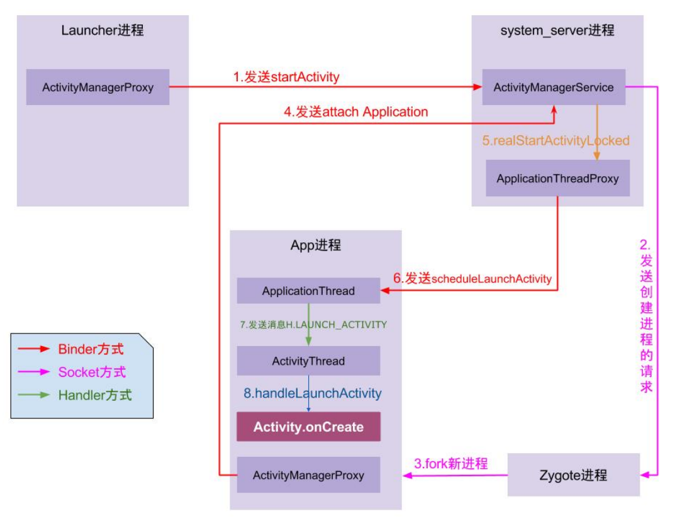

# 1 Activity启动流程
分为两种情况:1.从桌面点击进入；2.App进程内进入
## 1.1 从桌面点击进入

桌面Launcher进程捕获点击事件，解析目标App的Intent（包含MAIN Action和LAUNCHER Category），通过Binder IPC向system_server进程中的  ActivityManagerServices发起startActivity请求，  
system_server的AMS收到请求后，先检查App进程是否存在，如果不存在，那么通过Socket向Zygote进程发起创建App进程的请求，  
Zygote进程fork出新的进程，即App进程，  
App进程在被创建后，随即通过Binder IPC向system_server进程的AMS发出  attachApplication请求，该请求将ApplicationThread绑定到AMS，  
AMS收到请求之后，创建Application对象，调用attachBaseContext，初始化ContentProvider以及执行Application.onCreate，  
AMS在初始化完成之后，通过Binder IPC向App进程发送scheduleLaunchActivity请求，
App进程的Binder线程（ApplicationThread）收到之后，通过Handler向App主线程发送LAUNCH_ACTIVITY消息，  
主线程接受到消息后，通过发射机制创建目标Activity，并回调Activity.onCreate、onStart、onResume等生命周期方法，  
WindowManager添加窗口，SurfaceFlinger完成UI渲染



## 1.2 从App内进入
App进程->(AMP，ActivityManagerProxy)startActivity(Hook插入点1)->system_server进程AMS->解析启动参数，scheduleLaunchActivity->App进程，ApplicationThread->ActivityThread(Hook插入点2)->Activity生命周期


## 1.3 补充内容
1. 什么是Launcher进程？
即桌面进程，用于桌面显示、近期任务切换等，由SystemServer启动（即system_server进程）

2. 什么是system_server进程？
system_server进程是Android核心系统进程之一，用于管理几乎所有关键系统服务，如AMS、WMS、PMS，
system_server由java类SystemServer.java运行，由Zygote进程fork出来

3. 什么是Zygote进程？
Zygote进程是Android最重要的核心进程之一，用于孵化所有App进程和system_server进程，
主要作用是创建Android运行时环境，预加载Android SDK核心类，fork其他进程，
由init进程fork

4. 什么是ActivityManagerServices
ActivityManagerService（AMS） 是 Android 系统中 负责管理应用进程和 Activity 生命周期的核心服务，它属于 Framework 层，运行在 system_server 进程 中。

它的主要职责包括：  
✅ 进程管理：启动、停止、回收应用进程（与 Zygote 交互）  
✅ Activity 管理：启动、暂停、销毁 Activity（维护 Activity 栈）  
✅ 任务栈管理：控制 Task（任务栈）和 Back Stack（返回栈）  
✅ 广播（Broadcast）管理：分发 BroadcastReceiver  
✅ Service 管理：启动、绑定、停止 Service  
✅ ANR 监控：检测 App Not Responding（ANR）  


# 2 onSaveInstanceState(), onRestoreInstanceState调用时机
onSaveInstanceState和onRestoreInstanceState主要用于Activity和Fragment遭遇意外销毁（屏幕旋转、系统回收资源），保存和恢复临时UI状态
1. onSaveInstanceState  
- 从最近应用切换其他程序
- 按下HOME键
- 屏幕方向切换
- 按电源键
- 从当前Activity启动一个新的Activity
生命周期：onPause->onSaveInstanceState->onStop
onSaveInstanceState常用于保存UI临时状态，比如输入框内容、滚动条位置

2. onRestoreInstanceState  
只有在Activity确实被系统回收、重建Activity的情况下才会用，如
- 屏幕旋转, 屏幕旋转时，Activity生命周期如下：onPause->onSaveInstanceState->onStop->onDestroy->onCreate->onStart->onRestoreInstanceState->onResume
- 在后台被回收
- 按HOME键返回桌面，然后点击应用图标回到原来的页面，Activity生命周期：onStart->onRestoreInstanceState->onResume
注意：仅当onSaveInstanceState非空才调用onRestoreInstanceState，因此，onRestoreInstanceState被调用，onSaveInstanceState一定会被调用
3. 源码  
系统会调用ActivityThread的preformStopActivity方法中调用onSaveInstanceState，将状态保存在mActivities中，mActivities维护了Activity信息表，当Activity重启时，先从mActivities查询到对应的ActivityClientRecord，
如果有信息，则调用Activity的onRestoreInstanceState方法，
在ActivityThread的performLaunchActivity方法中，会判断ActivityClientRecord对象state是否为空
不为空，通过Activity的onSaveInstanceState获取其UI状态信息，通过这些信息传递给onCreate方法

4. onCreate与onRestoreInstanceState两者都可以用于恢复状态：
- onCreate(Bundle savedInstanceState) 在 Activity 创建 时调用，可用于恢复状态。
- onRestoreInstanceState(Bundle savedInstanceState) 仅在 onSaveInstanceState() 发生后 才调用。

# 3 Activity的启动模式（Launch Mode）和使用场景
## 3.1 什么是任务栈
我们每次打开一个新的Activity，或者退出当前的Activity，都会在一个称为任务栈的结构中增减Activity，一个任务栈包含一组Activity集合，
Android通过ActivityRecord、TaskRecord、ActivityStack、ActivityStackSupervisor、ProcessRecord有序的管理每个Activity

## 3.2 Standard
默认模式，每次启动Activity都会创建一个新的Activity实例  
适用场景：可以重复打开，无需复用的页面，如详情页
## 3.3 SingleTop
栈顶复用模式，若目标Activity存在栈顶，直接复用，调用该Activity.onNewIntent方法，如果目标Activity不存在栈顶，重建实例  
适用场景：通知栏跳转详情页、支付结果页，防止栈顶重复创建
## 3.4 SingleTask
栈内单例，若目标Activity存在，则清除上方页面，并复用，如果不存在，那么新建Activity  
适用场景：主界面
## 3.5 SingleInstance
全局单例，单开一个Task，仅允许存在目标Activity  
适用场景：系统级单个页面，如来电页面

## 3.6 启动模式与Intent Flags关系
开发者可以通过 Intent.addFlags() ​动态覆盖 Manifest 中静态定义的启动模式：  
|常用Flag|说明|
|---|-------|
|FLAG_ACTIVITY_NEW_TASK	|在新任务栈中启动 Activity（需与 singleTask 或 taskAffinity 配合）|
|FLAG_ACTIVITY_CLEAR_TOP|若目标 Activity 已存在，清除其上的所有 Activity。|
|FLAG_ACTIVITY_SINGLE_TOP|效果等同 singleTop 模式|

# 4 Activity A跳转Activity B，再按返回键，生命周期执行顺序
A跳转B：A.onPause->B.onCreate->B.onStart->B.onResume->A.onStop  
B在按下back键：B.onPause->A.onRestart->A.onStart->A.onResume->B.onStop->B.onDestroy  

如果B的launchMode是singleInstance、singleTask且B有可复用实例，生命周期回调如下：  
A.onPause->B.onNewIntent->B.onRestart->B.onStart->B.onResume->A.onStop->(A被移除的话)A.onDestory  

当B的launchMode是singleTop且已经在栈顶，此时:  
B.onPause->B.onNewIntent->B.onResume  

# 5 横竖屏切换、HOME键、返回键、锁屏与解锁，跳转透明Activity，启动一个Theme为Dialog的Activity，弹出Dialog的Activity生命周期
1. 横竖屏切换
```xml
<activity
    android:name=".MainActivity"
    android:configChanges="orientation|screenSize|screenLayout|keyboardHidden" />
```
仅当设置上述属性，横竖屏切换才不会触发Activity重建，仅触发onConfigurationChanged方法回调  

启动：onCreate->onStart->onResume  
切换横竖屏：onPause->onSaveInstanceState->onStop->onDestory->onCreate->onStart->onSaveInstanceState->onResume  
2. HOME键  
onPause->onStop->onRestart->onStart->onResume  
3. BACK键
onPause->onStop->onDestory
4. 锁屏  
锁屏只会调用onPause，不会调用onStop，开屏后onResume  
5. 弹出Dialog  
Dialog是通过WindowManager.addView显示的，没有经过AMS，所以不会对生命周期有任何影响  
6. A跳转Theme为Dialog的Activity、透明Activity B  
A.onPause->B.onCreate->B.onStart->B.onResume  
注意：如果Activity A跳转了一个theme为Dialog的Activity B，但是B设置了全屏，那么此时A的onStop会被回调：  
A.onPause->B.onCreate->B.onStart->B.onResume->A.onStop  
A.onStop是否回调判断依据是A是否完全不可见

# 6 onStart和onResume, onPause和onStop的区别  
onStart表示页面已经可见  
onResume表示页面可交互，能够获取焦点  
onStop表示页面不可见  
onPause表示页面失去焦点，不可交互  

# 7 Activity之间传递数据的方式Intent是否有大小限制，如果传递数量偏大，有哪些方案
Intent携带数据要从App进程IPC到system_server进程的AMS处理，使用的是Binder通信，Binder通信有大小限制，通常是1MB，Binder本身不是为了拷贝大量数据，而是为了进程间频繁、灵活通信设计，是一种轻量级、低开销的IPC机制  
如果是非IPC，那么使用单例、SQlite、Sharedpreference、file都可以  
如果是IPC，考虑使用共享内存和Socket

Binder 通信过程：  
1. Binder驱动在内核空间创建一个数据接收缓存区；  
2. 在内核空间开辟一块内核缓存区，建立内核缓存区和内核空间数据接收区之间的映射关系，以及内核中数据接收缓存区和接收进程用户空间地址的映射关系；  
3. 发送方进程通过系统调用copyfromuser将数据copy到内核空间的内核缓存区，由于内核缓存区和接收进程的用户空间存在内存映射，因此也就相当于把数据发送到了接收进程的用户空间，这样便完成了一次进程间通信，相比Socket，少了一次内存拷贝.

# 8 Activity的onNewIntent方法什么时候执行
## 8.1 调用时机
onNewIntent是复用Activity实例时处理新Intent的核心方法，适用于需要动态更新界面或避免重复创建的场景，调用时机：  
1. Activity的LaunchMode为SingleTop时，如果Activity在栈顶，且现在要启动Activity，此时调用onNewIntent
2. Activity的LaunchMode为SingleInstance、SingleTask时，如果Activity已经在堆栈中，此时调用onNewIntent  
3. Activity处于任务栈顶端，现在处于onPause、onStop状态，其他应用发送Intent，执行顺序为：onNewIntent->onReStart->onStart->onResume


Standard模式启动的Activity，不会调用onNewIntent，因为Standard模式默认新建实例，而没有复用的情况，但如果发送方Intent添加了`FLAG_ACTIVITY_SINGLE_TOP`或`FLAG_ACTIVITY_REORDER_TO_FRONT`等标志，会改变栈行为，此时会触发onNewIntent

## 8.2 onNewIntent注意事项
1. onNewIntent中需要手动调用setIntent(intent)，否则新传入的Intent没有保存，后续使用getIntent会返回旧数据  
2. onNewIntent调用时机一定在onStart和onResume之前（如果有的话）

# 9 显式启动和隐式启动
## 9.1 显式启动
1. setComponent
```java
Intent intent = new Intent();
// 参数1：目标组件的包名（如其他应用的包名）
// 参数2：目标Activity的完整类名（包括包路径）
ComponentName component = new ComponentName(
    "com.example.app", 
    "com.example.app.SecondActivity"
);
intent.setComponent(component);
startActivity(intent);
```
2. setClassName
```java
Intent intent = new Intent();
// 方式1：指定包名和类名字符串
intent.setClassName(
    "com.example.app", 
    "com.example.app.SecondActivity"
);

// 方式2：通过当前上下文自动填充包名（适用于同应用内）
intent.setClassName(
    MainActivity.this, 
    "com.example.app.SecondActivity"
);

startActivity(intent);
```
3. Intent构造方法
```java
Intent intent = new Intent(A.this,B.this);
startActivity(intent);
```
4. setClass
```java
Intent intent = new Intent();
// 参数：当前上下文 + 目标Activity的Class对象
intent.setClass(MainActivity.this, SecondActivity.class);
startActivity(intent);
```
## 9.2 隐式启动
1. 基本概念  
Activity的隐式启动是通过声明一组条件（如action/category/data）,由系统匹配符合条件的组件来启动Activity的方式，格式形如：  
```xml
<activity android:name=".DetailActivity">
    <intent-filter>
        <!-- 必须声明的 Action -->
        <action android:name="android.intent.action.VIEW" />
        <!-- 默认 Category -->
        <category android:name="android.intent.category.DEFAULT" />
        <!-- 允许通过浏览器链接启动 -->
        <category android:name="android.intent.category.BROWSABLE" />
        <!-- 声明支持的 Data 格式 -->
        <data
            android:scheme="https"
            android:host="example.com"
            android:pathPrefix="/detail" />
    </intent-filter>
</activity>
```
调用方式
```kotlin
val intent = Intent().apply {
    action = Intent.ACTION_VIEW
    data = Uri.parse("https://example.com/detail?id=123")
}
startActivity(intent)
```
2. 匹配规则  
**action匹配规则**  
Intent-filter的action可以设置多条，至少一个  
intent中的action只能设置一条，只要跟Intent—filter其中一条匹配即可  

**category匹配规则**  
Intent-filter可以包含一条或多条category，可缺省，不过一般都会显式设置`<category android:name="android.intent.category.DEFAULT" />`，如果不设置，Intent需要手动添加category  
```kotlin
val intent = Intent("com.example.ACTION_CUSTOM").apply {
    // 隐式启动需主动添加默认 Category
    addCategory(Intent.CATEGORY_DEFAULT)
}
startActivity(intent)
```
Intent中category也可以有多条，也可以不设置  
Intent中所有的category都可以在Intent-filter中找到一样的（大小写区分）才算匹配成功

**data匹配规则**  
Intent-filter中可以设置0个或多个data
Intent只能设置一个data  
Intent-filter如果设置了data，Intent必须匹配其中一个data，每个字段都必须匹配


## 9.3 注意事项  
- 如果Activity设置了`exported=true`,此时如果是内部跳转，仍然可以跳转成功，如果是外部跳转（其他App），会报`SecurityException`
- 如果跳转的Activity不存在，会报`ActivityNotFoundException`异常


# 10 scheme使用场景、协议格式、如何使用
scheme是一种页面内跳转协议，隐式启动中的data字段一般遵循scheme格式，广义上来讲，常见的deeplink是一种特殊的scheme协议  

```xml
<activity android:name=".ui.DeepLinkActivity">
    <intent-filter>
        <!-- 指定支持的 Scheme
            scheme字段定义协议名称，host定义了主机域名
         -->
        <data android:scheme="myapp"
              android:host="home" />
        
        <!-- 允许外部调用 -->
        <action android:name="android.intent.action.VIEW" />
        <category android:name="android.intent.category.DEFAULT" />
        <!-- 允许从浏览器打开 -->
        <category android:name="android.intent.category.BROWSABLE" />
    </intent-filter>
</activity>

```
App内跳转
```kotlin
val intent = Intent(Intent.ACTION_VIEW, Uri.parse("myapp://home?user=123"))
startActivity(intent)
```

除此之外，还能直接用于前端网页跳转
```xml
<a href="myapp://home?user=123">打开 App</a>
```
ADB指令打开
```shell
adb shell am start -a android.intent.action.VIEW -d "myapp://home?user=123"
```

在Android12之后，android:exported="true" 必须显式声明，否则可能无法跳转

# 11 ANR的四种场景
- Service TimeOut：Service未在规定时间执行完成，前台20s，后台200s
- BroadCastQueue TimeOut：未在规定时间内处理完广播，前台10s，后台60s
- ContentProvider TimeOut:publish在10s内没有完成
- Input Dispatching TimeOut：5s内未响应键盘、输入事件等

Activity的生命周期阻塞并不在触发ANR场景里，并不会直接造成ANR  
但是会阻塞主线程，间接导致以上四种情况的发生

# 12 onCreate和onRestoreInstance恢复数据的区别
| 方法                         | 触发时机                                                        | 适用场景                                         |
|------------------------------|----------------------------------------------------------------|-------------------------------------------------|
| `onCreate(Bundle?)`          | Activity 创建时（无论是首次创建还是因配置变化重建）            | 适用于所有初始化逻辑，包括首次启动和重建时的数据恢复 |
| `onRestoreInstanceState(Bundle)` | `onStart()` 之前，仅在 Activity 因异常销毁（如屏幕旋转）而重建时调用 | 仅适用于因系统回收或配置更改导致 Activity 重建时的数据恢复 |


# 13 Activity间传递数据的方式
1. 通过Intent传递（putExtra内部是一个Bundle）  
2. 通过全局变量传递
3. SharedPreference
4. 数据库
5. 文件

# 14 跨App启动Activity方式
1. 使用IntentFilter隐式跳转  
如果有两个action属性相同的Activity，那么在启动时手机系统会让用户手动选择，为了避免这种情况， 需要设置category、data等字段  

2. 如何防止自己的Activity被外部恶意启动  
- 私有权限
- 签名校验
- 包名校验


# 15 Activity的任务栈是什么
1. Task Stack即任务栈，用于存放管理Activity,是一个标准的栈结构，具有后进先出的特点；  
2. 只有栈顶的Activity才能获取焦点，与用户交互；  
3. 退出应用时，所有的栈都会被清空销毁，任务栈也可以退至后台，并保留每一个Activity状态；
4. 对应AMS中ActivityRecord、TaskRecord、ActivityStack

# 16 有哪些Activity常用的标记位Flags
1. `FLAG_ACTIVITY_NEW_TASK` 指定Activity启动模式为`singleTask`，效果与AndroidManifest中指定`launchMode = "singleTask"`相同
2. `FLAG_ACTIVITY_SINGLE_TOP` 指定Activity启动模式为`singleTop`, 效果与AndroidManifest中指定`launchMode = "singleTop"`相同
3. `FLAG_ACTIVITY_CLEAR_TOP` Activity启动时，会将栈中位于它上方的Activity全部清除，一般和singleTask一起使用，如果被启动的Activity实例存在，那么会触发onNewIntent

# 17 Activity被回收之后，onSaveInstanceState与onRestoreInstance调用流程是怎样的？

## 17.1 onSaveInstanceState触发时机
当系统需要销毁Activity时（屏幕旋转、内存回收、进程终止），会触发onSaveInstanceState方法保存数据（如果是用户手动back杀死Activity，则不会触发）,生命周期顺序:onPause->onSaveInstanceState->onStop

```java
// Activity.java
protected void onSaveInstanceState(Bundle outState) {
    // 用于存储 Activity 状态
}
```

这个方法参数`outState` 用于存储数据，最终传递给`ActivityThread`持久化存储  
```java
// ActivityThread.java
private void performPauseActivity(ActivityClientRecord r, boolean finished) {
    ...
    if (r.activity != null) {
    
        Bundle outState = new Bundle();
        // 此时调用Activity的onSaveInstanceState()
        mInstrumentation.callActivityOnSaveInstanceState(r.activity, outState);
        // 存储outState
        r.state = outState;
    }
}
```
outState存在ActivityClientRecord中，ActivityThread中有一个属性叫mActivities（map结构），专用于保存Activity数据
```java
// ActivityThread.java
final ArrayMap<IBinder, ActivityClientRecord> mActivities = new ArrayMap<>();

```
## 17.2 onRestoreInstanceState的恢复过程
当Activity重建时，ActivityThread会从mActivities中取出保存的ActivityClientRecord实例对象中的Bundle，传值给onCreate  

```java
// ActivityThread.java
private Activity performLaunchActivity(ActivityClientRecord r, Intent customIntent) {
    ...
    Activity activity = mInstrumentation.newActivity(cl, component.getClassName(), r.intent);
    if (r.state != null) {
        r.activity.attach(...);
        // 调用被恢复的Activity
        r.activity.performCreate(r.state);
    }
}
```
如果mActivities中的数据不为空，那么onRestoreInstanceState进行额外恢复

onCreate和onRestoreInstanceState都能恢复数据，但是onCreate调用时，View层级已经创建，但是尺寸和布局还没有计算完成，不适合做UI逻辑处理，onRestoreInstanceState在onStart之后调用，所有View已经初始化完毕，不存在这个问题  
onCreate除了在异常重建时调用，还会在正常Activity启动时调用，习惯上，onCreate更适合做业务逻辑初始化，onRestoreInstanceState只会在saveInstanceState不为空时调用，更适合做恢复  
此外，onCreate发生在Activity启动不可见时，如果业务逻辑过于复杂，容易造成ANR，体验更糟糕
