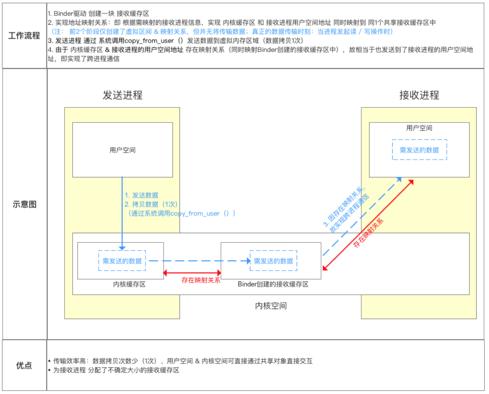

# 1 Android中进程和线程的关系和区别  

进程是系统进行资源分配和调度的基本单位，可以独立运行一段程序。线程是进程的一个实体，比进程更小、独立运行的基本单位，线程自己不拥有系统资源，只是在运行时，占用一些计数器、寄存器和栈  

进程有不同的代码和数据空间，而多个线程共享数据空间，每个线程有自己的执行堆栈和程序计数器为其执行上下文  

进程之间相互独立，同一进程的线程间共享数据  

进程间通信IPC，线程可以直接读写进程数据来进行通信（需要同步和互斥手段辅助，保证数据一致性）  

# 2 为何需要进行IPC，多进程通信可能会出现什么问题  

为了保证进程空间不被其他进程破坏或者干扰，Linux中的进程是相互独立或相互隔离，在Android系统中应用默认只有一个进程，每个进程都有自己独立的资源和内存空间，其它进程不能任意访问当前进程的内存和资源，这样导致在不同进程的四大组件无法通信，所以需要有一套IPC通信机制解决进程通信、数据传输问题  

开启多进程虽然简单，但会引发如下问题，需要谨慎：  
1. 静态成员和单例模式失效  
2. 线程同步机制失效  
3. SharedPreferences可靠性降低  
4. Application多次创建  
5. 文件锁与数据库并发冲突  
6. 线程同步机制失效  

子进程尽量不要有数据IO操作，如果数据量不大，尽可能通过Binder机制通过主进程来进行IO，如果数据量巨大，数据IO尽可能通过

# 3 Android中IPC方式有几种，各种方式优缺点  


# 4 为何新增Binder来作为主要的IPC方式  

Android基于Linux内核开发，Linux现有的进程间通信手段有管道、消息队列、共享内存、套接字、信号量等  

Android重新设计一套Binder机制主要基于以下考量：  
1. 效率：传输效率主要影响因素是内存拷贝的次数，拷贝次数越少，传输速率越高。从Android进程架构角度分析：对于消息队列、Socket和管道来说，数据先从发送方的缓存区拷贝到内核开辟的缓存区中，再从内核缓存区拷贝到接收方的缓存区，一共两次拷贝。  

一次数据传递需要经历：用户空间->内核缓存区->用户空间，需要两次拷贝  

从Binder角度：数据从发送方的缓存区拷贝到内核的缓存区，而接收方的缓存区和内核的缓存区是映射到一块物理内存的，节省了一次拷贝过程，共享内存不需要拷贝，Binder性能仅次于共享内存  

2. 稳定性：Binder基于C/S架构，Server与Client相对独立，稳定性好，无需面临死锁和资源竞争等问题，这是共享内存不具备的  

3. 安全性：传统Linux IPC接收方无法获得对方的可靠UID和PID，无法鉴别对方身份，而Binder机制为每个进程分配了UID和PID，可以进行有效检验  

# 5 什么是Binder  

从进程间通信的角度看，Binder 是一种进程间通信的机制；  
从 Server 进程的角度看，Binder 指的是 Server 中的 Binder 实体对象(Binder类 IBinder)；  
从 Client 进程的角度看，Binder 指的是对 Binder 代理对象，是 Binder 实体对象的一个远程代理  
从传输过程的角度看，Binder 是一个可以跨进程传输的对象；Binder 驱动会自动完成代理对象和本地对象之间的转换。  
从Android Framework角度来说，Binder是ServiceManager连接各种Manager和相应ManagerService的桥梁  
Binder跨进程通信机制：基于C/S架构，由Client、Server、ServerManager和Binder驱动组成。  
进程空间分为用户空间和内核空间。用户空间不可以进行数据交互；内核空间可以进行数据交互，所有进程共用一个内核空间  
Client、Server、ServiceManager均在用户空间中实现，而Binder驱动程序则是在内核空间中实现的  

# 6 Binder原理  




# 7 使用Binder进行数据传输的具体过程  


# 8 Binder框架中ServiceManager的作用  

1. 服务注册中心：ServiceManager作为一个中央注册中心，管理系统中所有Service，包括AMS、WMS这种系统服务，Service在启动时必须通过Binder机制向ServiceManager注册自身，注册时需要提供服务名称和Binder对象引用，SM保障唯一性  
2. 服务发现枢纽：客户端通过服务名称（字符创标志）从SM中获取Binder引用，从而实现IPC通信  
3. 权限控制：返回Binder引用之前，SM会检查客户端是否有权限访问该服务  
4. Binder通信基石：SM是Android系统启动最早初始化的服务质疑，为其他服务提供注册和查询的基石，所有通过Binder的IPC，都需要SM为起点获取目标Binder引用  

# 9 什么是AIDL  

AIDL是android提供的接口定义语言，简化Binder的使用 ， 轻松地实现IPC进程间通信机制。 AIDL会生成一个服务端对象的代理类，通过它客户端可以实现间接调用服务端对象的方法。

# 10 AIDL使用步骤  


# 11 AIDL支持哪些数据类型  

1. Java八种基本数据类型(int、char、boolean、double、float、byte、long、string) 但不支持short、String、CharSequence
2. List和Map，List接收方必须是ArrayList，Map接收方必须是HashMap
3. 实现Parcelable的类  

# 12 AIDL的关键类、方法和工作流程  

Client/Server都使用同一个AIDL文件，在AIDL编译后生成Java文件，其中有Stub服务实体和Proxy服务代理两个类  

AIDL接口：编译完生成的接口继承IInterface  

Stub类：服务实体，Binder的实体类，服务端一般会实例化一个Binder对象，在服务端onBind中绑定，客户端asInterface获取到Stub， 这个类在编译AIDL文件后自动生成，它继承自Binder，表示它是一个Binder本地对象，它是一个抽象类，实现了IInterface接口，表明它的之类需要实现Server将要提供的能力，即AIDL文件中声明的接口方法  

Stub.Proxy类：服务的代理，客户端asInterface获取到Stub.Proxy，它实现了IInterface接口，说明它是Binder通信过程的一部分；它实现了AIDL中声明的方法，但最终还是交由其中的mRemote成员来处理，说明它是一个代理对象，mRemote成员实际上就是BinderProxy  

asInterface：客户端在ServiceConnection通过Stub.asInterface，会根据是同一进行通信，还是不同进程通信，返回Stub实体，或者Stub.Proxy代理对象  

transact：运行在客户端，当客户端发起远程请求时，内部会把信息包装好，通过transact()向服务端发送。并将当前线程挂起，Binder驱动完成一系列的操作唤醒 Server 进程，调用 Server 进程本地对象的 onTransact()来调用相关函数，到远程请求返回，当前线程继续执行  

onTransact()：运行在服务端的Binder线程池中，当客户端发起跨进程请求时， onTransact()根据 Client传来的code调用相关函数，调用完成后把数据写入Parcel，通过reply发送给Client。驱动唤醒 Client 进程里刚刚挂起的线
程并将结果返回  


# 13 如何优化多模块都使用AIDL的情况  

# 14 使用Binder传输数据的最大限制是多少，被占满会导致什么问题  

Binder传输最大限制取决于Binder事物缓冲区大小，默认上限是1016K
```c
// drivers/android/binder.c
#define BINDER_VM_SIZE ((1 * 1024 * 1024) - 4096 * 2)
```
补充：减去8K是留给Binder驱动自身的元数据  

如果传输数据超出最大限制，Binder会拒绝处理该调用，通过JNI向Java层抛出`TransactionTooLargeException`异常

另外：ServiceManager比较特殊，它为自己申请的Binder内核空间是128K，这个同ServiceManager的用途是分不开的，SM主要面向系统服务，提供一些addService、getService功能，本身并不提供数据传输功能，也不需要申请太大的内存  

# 15 Binder驱动加载过程中有哪些重要的步骤  

从 Java 层来看就像访问本地接口一样，客户端基于 BinderProxy 服务端基于 IBinder 对象  
在Native层有一套完整的binder通信的C/S架构，Bpinder作为客户端，BBinder作为服务端。基于naive层的Binder框架，Java也有一套镜像功能的binder C/S架构，通过JNI技术，与native层的binder对应，Java层的binder功能最终都是交给native的binder来完成  
从内核看跨进程通信的原理最终是要基于内核的，所以最会会涉及到 binder_open 、binder_mmap 和binder_ioctl这三种系统调用  


# 16 系统服务（SystemServer）与bindService启动的服务的区别  

服务可分为系统服务与普通服务，系统服务一般是在系统启动的时候，由SystemServer进程创建并注册到ServiceManager中 例如AMS，WMS，PMS。而普通服务一般是通过ActivityManagerService启动的服务，或者说通过四大组件中的Service组件启动的服务。不同主要从以下几个方面：  

服务的启动方式 系统服务这些服务本身其实实现了Binder接口，作为Binder实体注册到ServiceManager中，被ServiceManager管理。这些系统服务是位于SystemServer进程中  
普通服务一般是通过Activity的startService或者其他context的startService启动的，这里的Service组件只是个封装，主要的是里面Binder服务实体类，这个启动过程不是ServcieManager管理的，而是通过ActivityManagerService进行管理的，同Activity管理类似  

服务的注册与管理  

系统服务一般都是通过ServiceManager的addService进行注册的，这些服务一般都是需要拥有特定的权限才能注册到ServiceManager，而bindService启动的服务可以算是注册到ActivityManagerService，只不过ActivityManagerService管理服务的方式同ServiceManager不一样，而是采用了Activity的管理模型  

服务的请求使用方式  

使用系统服务一般都是通过ServiceManager的getService得到服务的句柄，这个过程其实就是去ServiceManager中查询注册系统服务。而bindService启动的服务，主要是去ActivityManagerService中去查找相应的Service组件，最终会将Service内部Binder的句柄传给Client  

# 17 Activity的bindService流程  
1. Activity调用bindService：通过Binder通知ActivityManagerService要启动哪个Service  
2. ActivityManagerService创建ServiceRecord，并利用ApplicationThreadProxy回调，通知App新建并启动Service  
3. AMS启动Service之后，通过ApplicationThreadProxy通知App bindService，让Service返回一个Binder对象给AMS，以便AMS传递给Client  
4. AMS把从Service处得到的Binder对象，通过ServiceConnection接口回调给Activity  
5. Activity拿到回调后，通过Binder Stub的asInterface方法将Binder转换为代理Proxy，完成业务代理的转换，之后就能利用Proxy进行通信了  


# 18 不通过AIDL，手动编码来实现Binder通信  