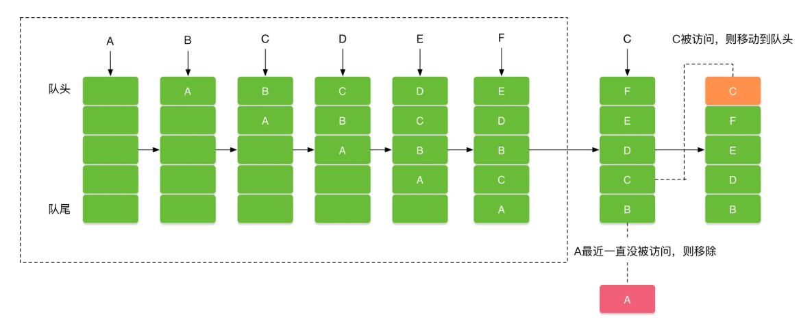

# 1 Bitmap内存占用计算  

Bitmap内存占用 = 宽度像素个数 x 高度像素个数 x 每个像素占用内存  

其中，每个像素占用内存和像素格式有关，参见：  

```java
public static final Bitmap.Config ALPHA_8 //代表8位Alpha位图 每个像素占用1byte内存
public static final Bitmap.Config ARGB_4444 //代表16位ARGB位图 每个像素占用2byte内存
public static final Bitmap.Config ARGB_8888 //代表32位ARGB位图 每个像素占用4byte内存
public static final Bitmap.Config RGB_565 //代表8位RGB位图 每个像素占用2byte内存
```  

如果直接从SD卡读取一张图片，直接计算即可，如果是从密度目录中读取，那么还要考虑缩放比例  

举例：  

那么对于一张2000x2000的ARGB_8888图片，在`res/drawable-xxhdpi`目录中，设备屏幕密度为`xxxhdpi`，内存占用计算：  

系统自动缩放比例：缩放比例 = 目标密度/资源密度 = 640dpi/480dpi = 1.333  

实际宽高：宽 = 2000/(640/480) = 1500 , 高 = 2000/(640/480) = 1500  

内存占用 = 1500 x 1500 x 4 = 9,000,000 byte ≈ 8.58 MB  

代码验证方式：  
```java
val bitmap = BitmapFactory.decodeResource(resources, R.drawable.your_image)
val byteCount = bitmap.allocationByteCount // 实际分配的内存大小
Log.d("Bitmap", "内存占用：${byteCount / 1024 / 1024} MB")
```

# 2 getByteCount和getAllocationByteCount的区别  

如果被复用的Bitmap的内存比待分配内存的Bitmap大  
getByteCount()获取到的是当前图片应当所占内存大小  
getAllocationByteCount()获取到的是被复用Bitmap真实占用内存大小  
在复用Bitmap的情况下，getAllocationByteCount()可能会比getByteCount()大  

# 3 Bitmap的压缩方式  

1. 质量压缩  

通过降低图片的质量精度（如JPEG的压缩率），牺牲画质来减小文件体积，但内存占用不变  

```java
fun compressQuality(bitmap: Bitmap, quality: Int, format: Bitmap.CompressFormat): ByteArray {
    val outputStream = ByteArrayOutputStream()
    bitmap.compress(format, quality, outputStream) // 质量参数（0-100）
    return outputStream.toByteArray()
}
```
适用于上传服务器，减少网络传输流量，保存到本地的图片  

注意：质量参数非线性，quality=50并不代表体积减半，如果是PNG这种无损格式，那么这个方法不会生效  

2. 尺寸压缩  

减少图片的像素数量，降低内存占用和文件体积  
```java
fun compressSize(bitmap: Bitmap, newWidth: Int, newHeight: Int): Bitmap {
    return Bitmap.createScaledBitmap(bitmap, newWidth, newHeight, true)
}
```

适用于对图片精度要求没有那么高的地方（如缩略图），大图加载避免OOM等  

3. 像素格式优化  

直接改变图片的像素格式  
```java
val options = BitmapFactory.Options().apply {
    inPreferredConfig = Bitmap.Config.RGB_565
}
val bitmap = BitmapFactory.decodeResource(resources, R.drawable.photo, options)
```

注意，改变像素格式可能导致显示问题，如透明背景变黑色不透明，慎用！  

4. 文件格式优化  

使用webp格式文件，有损模式比JPEG小30%体积，无损格式比PNG小20%的体积  

# 4 LruCache和DiskLruCache原理  

LruCache和DiskLruCache是Android中非常常见的缓存机制，Glide缓存机制是基于LruCache、DiskLruCache建立起来的  

## 4.1 LruCache  

LRU（Least Recently Used）是一种缓存淘汰算法，核心思想是当缓存空间不足时，优先淘汰最久未被访问的数据    

  

LruCache内部是一个双向链表+哈希表  
双向链表用于维护访问顺序，哈希表用于快速查找，Android中的LruCache是直接使用LinkedHashMap作为实现   
```java
// 初始化 LinkedHashMap，accessOrder=true 表示按访问顺序排序,false表示插入排序
public LinkedHashMap(int initialCapacity, float loadFactor, boolean accessOrder) {
    super(initialCapacity, loadFactor);
    this.accessOrder = accessOrder;
}

// LinkedHashMap.get() 的简化逻辑
public V get(Object key) {
    Node<K,V> e = getNode(key);
    if (e != null && accessOrder) {
        // 将节点移到链表尾部
        afterNodeAccess(e);
    }
    return e.value;
}
```

LruCache写入时，会检查当前缓存大小，如果超出maxSize时，则循环移除表头旧数据  
```java
// LruCache.put() 的简化逻辑
public final V put(K key, V value) {
    V previous = map.put(key, value);
    if (previous != null) {
        size -= safeSizeOf(key, previous); // 更新当前缓存大小
    }
    trimToSize(maxSize); // 检查并淘汰旧数据
    return previous;
}

// 淘汰逻辑
private void trimToSize(int maxSize) {
    while (true) {
        Map.Entry<K, V> toEvict = map.eldest(); // 获取链表头部节点（最久未使用）
        if (toEvict == null) break;
        remove(toEvict.getKey()); // 移除该节点
    }
}
```

适用场景：  
- 内存敏感的高频访问数据，如图片加载，Glide缓存机制用到了LruCache  
- 网络请求结果的临时缓存    

使用举例：  
```java
// 创建 LruCache 实例（以 Bitmap 缓存为例）
int maxMemory = (int) (Runtime.getRuntime().maxMemory() / 1024); // 单位 KB
int cacheSize = maxMemory / 8; // 使用 1/8 内存作为缓存
LruCache<String, Bitmap> bitmapCache = new LruCache<String, Bitmap>(cacheSize) {
    @Override
    protected int sizeOf(String key, Bitmap value) {
        // 计算每个 Bitmap 占用的内存（单位需与 cacheSize 一致）
        return value.getByteCount() / 1024;
    }
};

// 存入缓存
bitmapCache.put("image_key", bitmap);

// 读取缓存
Bitmap cachedBitmap = bitmapCache.get("image_key");

// 淘汰监听（可选）
@Override
protected void entryRemoved(boolean evicted, String key, Bitmap oldValue, Bitmap newValue) {
    if (evicted) {
        // 资源被淘汰时的回收逻辑
        oldValue.recycle();
    }
}
```

## 4.2 DiskLruCache  

DiskLruCache通过日志文件跟踪访问记录+LRU缓存淘汰策略，实现了高效的磁盘缓存管理，核心价值在于：持久化存储、自动淘汰机制和高性能缓存  

1. Journal文件  
DiskLruCache通过在磁盘中维护一个简单的Journal文件来记录各种缓存操作，记录类型有4种，分别是READ、REMOVE、CLEAN和DIRTY  

写入缓存的时候会向journal文件写入一条以DIRTY开头的数据表示正在进行写操作，当写入完毕时，分两种情况：  

- 写入成功，会向journal文件写入一条以CLEAN开头的记录，其中包括该文件的大小  
- 写入失败，会向journal文件写入一条以REMOVE开头的记录，表示删除了该条缓存。也就是说每次写入缓存总是写入两条操作记录。  

读取的时候，会向journal文件写入一条以READ开头的记录, 表示进行了读操作  

删除的时候，会向journal文件写入一条以REMOVE开头的记录, 表示删除了该条缓存  

通过journal就记录了所有对缓存的操作。并且按照从上到下的读取顺序记录了对所有缓存的操作频繁度和时间顺序, 这样当退出程序再次进来调用缓存时，就可以读取这个文件来知道哪些缓存用的比较频繁了, 然后把这些操作记录读取到集合中，操作的时候就可以直接从集合中去对应的数据了。

2. 内部核心类  

DiskLruCache内部利用LinkedHashMap实现LRU算法，除此之外还有3个核心内部类：  
- `Editor`：缓存写入实物控制器  
- `Snapshot`：缓存读取一致性视图  
- `Entry`：缓存条目的元数据载体  

Editor管理缓存条目的​写入、修改或删除，确保操作的 ​原子性​（要么完全成功，要么完全失败）  

```java
DiskLruCache.Editor editor = diskLruCache.edit("image_key");
try {
    OutputStream out = editor.newOutputStream(0); // 获取写入流
    out.write(imageData);                        // 写入临时文件
    editor.commit();                             // 提交修改
} catch (IOException e) {
    editor.abort();                              // 回滚操作
}
```

Snapshot提供缓存条目的只读访问，确保读取过程中数据不被修改  

```java
DiskLruCache.Snapshot snapshot = diskLruCache.get("image_key");
if (snapshot != null) {
    InputStream in = snapshot.getInputStream(0); // 获取输入流
    Bitmap bitmap = BitmapFactory.decodeStream(in);
    in.close();                                 // 手动关闭流
    snapshot.close();                           // 显式释放快照
}
```

`Entry`是一个元数据，关键属性包含：  
- `key`：条目的唯一标识（如 URL 的哈希值）  
- `lengths`：每个文件的大小数组（长度等于 valueCount）  
- `lastAccessTime`：最后一次访问时间戳，用于 LRU 排序  
- `inEditor`：标记条目是否正在被编辑（防止并发写入冲突）  

`DiskLruCache`的实现结合了数据库系统、文件系统和LRU算法，是磁盘缓存经典实现  

# 5 如何设计一个图片加载库  

# 6 如果有一张很大的图片，如何去加载  

一般情况下，Glide有内存监听、缓存复用、智能下采样等机制，可以应对大多数场景的大图加载  

对于特殊场景的超大图加载，如高清医学影像、卫星遥感图、地图等，可以考虑分块加载策略  

```java
// 初始化解码器
val decoder = BitmapRegionDecoder.newInstance(inputStream, false)

// 加载指定区域（Rect 单位为像素）
val rect = Rect(left, top, right, bottom)
val options = BitmapFactory.Options().apply {
    inPreferredConfig = Bitmap.Config.RGB_565
}
val regionBitmap = decoder.decodeRegion(rect, options)
imageView.setImageBitmap(regionBitmap)

// 释放资源
decoder.recycle()
```

注意，需要考虑到屏幕大小和分块图像的比例，动态计算块坐标  

# 7 如果把drawable-xxhdpi下的图片移动到drawable-xhdpi下，图片内存如何变化  

内存占用变化来自于缩放因子  

缩放因子 = 设备屏幕密度 / 资源目录屏幕密度  

xxhdpi对应480dpi，xhdpi对应320dpi  

对于320dpi设备，移动前，匹配到xxhdpi，缩放因子 = 320 / 480 = 0.667，实际宽高同时缩放 0.667x0.667 = 0.445  

移动后，匹配到xhdpi，缩放因子 = 320 / 320 = 1，实际宽高不变，即内存占用变化：1 / 0.445 = 2.25倍

把原本属于xxhdpi的图片直接移动到更低像素密度的目录会导致内存占用大幅度增加，应该放一个精度更低的图片  

# 8 如果hdpi、xxhdpi下都放置了图片，加载的优先级是怎样的  

drawable目录匹配优先精准匹配，如果没有对应目录，优先匹配最近高密度目录，如果不存在高密度目录，那么向下匹配最近低密度目录  

比如,320dpi设备，优先找drawable-xhdpi，如果这个目录不存在，继续找drawable-xxhdpi，如果更高密度的目录都不存在，那么从低密度目录匹配，找drawable-hdpi，都没有匹配到，再找drawable-nodpi，如果这个目录还是不存在，那么找drawable目录，默认目录肯定是存在的，在drawable找资源文件，如果找不到，抛出异常  

# 9 屏幕分辨率适配方案  

## 9.1 最小宽度限定符 

根据最小宽度动态选择资源  
```xml
res/
  values-sw320dp/       # 手机
    dimens.xml
  values-sw600dp/       # 平板
    dimens.xml
```
dimens.xml示例  
```xml
<!-- values-sw320dp/dimens.xml -->
<dimen name="button_width">160dp</dimen>

<!-- values-sw600dp/dimens.xml -->
<dimen name="button_width">300dp</dimen>
```

## 9.2 今日头条适配方案

也可以直接修改屏幕的像素密度，使不同密度的屏幕保持一致  
```java
// 代码示例（核心逻辑）
public class ScreenAdapter {
    // designWidthDp：设计稿的基准宽度（如360dp）
    public static void adaptScreen(Activity activity, int designWidthDp) {
        DisplayMetrics dm = activity.getResources().getDisplayMetrics();
        float targetDensity = dm.widthPixels * 1f / designWidthDp; // 计算目标density
        dm.density = targetDensity;      // 修改系统density
        dm.densityDpi = (int) (targetDensity * 160); // 修改dpi
    }
}
```

这样做的好处是一处修改、全局生效，一劳永逸，缺点是，会与现存的适配方案冲突，需要手动兼容