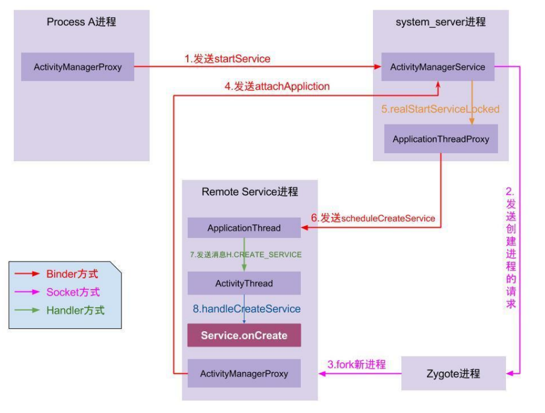

# 0 Service概述

Service是用于执行后台任务或者跨进程通信的核心组件，设计目标是用于处理不需要用户界面但必须长期运行的场景，如  
- 后台音乐播放
- GPS导航
- 跨进程处理结果（支付宝SDK用Service处理支付结果）
- 文件下载等后台耗时任务处理  

如果是短时间任务，如网络请求，可以考虑用线程、协程代替  
如果是延迟、定时任务，可以考虑用WorkManager代替


# 1 Service的生命周期、两种启动方式的区别

startService和bindService最大的区别就是前者独立运行，后者绑定组件（一般是Activity，但也可以是Fragment、Application）

- **startService**  
onCreate->onStartCommand->onDestroy  

- **bindService**  
onCreate->onBind->onUnbind->onDestroy  

## 1.1 两种方式区别

startService

1. 启动  
如果服务已经开启，多次执行startService不会重复执行onCreate，而是会调用onStart和onStartCommand  
如果服务已经开启，多次执行bindService，onCreate、onBind方法不会重复调用  

2. 销毁  
当执行stopService时，直接调用onDestroy  
调用者主动调用unbindService，后者调用者的Content不存在（如Activity被finish），Service就会调用onUnbind->onDestroy  
使用startService方法启用服务，调用者与服务之间没有关联，即使调用者被回收，服务仍然运行  
使用bindService方法启用服务，调用者和服务之间是绑定的，调用者退出，服务也会终止    

# 2 Service启动流程

# 2.1 startService流程



1. Process A进程采用Binder IPC向system_server进程（AMS）发起startService请求  
2. system_server进程接收到请求后，向Zygote进程发送创建进程请求  
3. Zygote进程fork子进程  
4. App进程，通过Binder IPC向system_server进程发起attachApplication请求  
5. system_server进程在收到请求后，进行一系列准备工作后，再通过Binder IPC向App进程发起scheduleCreateService请求  
6. App进程的Binder线程接收到请求后，通过Handler向主线程发送CREATE_SERVICE消息  
7. 主线程在收到Message后，通过发射机制创建目标Service，并回调Service.onCreate方法  

如果App进程已经存在，那么跳过2、3步骤

# 2.2 bindService流程

1. Process A进程发起bindService请求，ContextImpl.bindService接口被调用，通过Binder IPC向system_server进程发起请求  
2. system_server进程中的AMS收到请求，解析Intent数据，先判断是否有权限（没有权限直接抛出异常），然后通过Process.start向Zygote进程发起创建进程请求  
3. Zygote接收到请求后，fork子进程，执行ActivityThread.main作为App进程入口，以下是App进程初始化流程：  
- 创建ActivityThread:App主线程初始化，创建ApplicationThread，并注册到AMS  
- 绑定到AMS：通过IActivityManager.attachApplication通知AMS进程已启动  
- AMS回调：AMS收到attachApplication后，完成进程App进程初始化
4. AMS通过IApplicationThread.scheduleBindService，通知Process A绑定Service，A的处理逻辑：  
- 创建Service实例，通过反射调用目标Service构造函数，执行Service.onCreate  
- 调用onBind，并返回Service。onBind，返回IBinder对象，用于IPC  
- 通过IActivityManager.publishService发送回AMS  
5. AMS收到App的IBinder对象后，传递给调用方Process A，A回调onServiceConnected接口  
6. Process A获得IBinder对象后，与App进程的跨进程通信就建立了，可以将其转换成AIDL进行IPC  

# 3 Service与Activity如何通信
## 3.1 通过Binder对象  
1. Service中添加一个继承Binder的内部类，并添加相应的逻辑方法；  
2. Service中重写Service的onBind方法，返回我们刚刚定义的内部类实例；  
```java
// MyService.java
public class MyService extends Service {
    private final IBinder binder = new MyBinder();

    // 自定义 Binder 类，用于暴露 Service 的方法
    public class MyBinder extends Binder {
        MyService getService() {
            return MyService.this; // 返回 Service 实例
        }
    }

    @Override
    public IBinder onBind(Intent intent) {
        return binder; // 返回 Binder 对象
    }
}
```
3. Activity中bindService，重写ServiceConnection，onServiceConnection时返回IBinder调动逻辑方法；
```java
// MainActivity.java
public class MainActivity extends AppCompatActivity {
    private MyService myService;
    private boolean isBound = false;

    // 定义 ServiceConnection
    private ServiceConnection connection = new ServiceConnection() {
        @Override
        public void onServiceConnected(ComponentName name, IBinder service) {
            MyService.MyBinder binder = (MyService.MyBinder) service;
            myService = binder.getService();
            isBound = true;
            
            // 设置回调（接收 Service 发来的数据）
            myService.setCallback(new MyService.ServiceCallback() {
                @Override
                public void onTaskCompleted(String result) {
                    runOnUiThread(() -> {
                        // 处理业务逻辑
                    });
                }
            });
        }

        @Override
        public void onServiceDisconnected(ComponentName name) {
            isBound = false;
        }
    };

    @Override
    protected void onStart() {
        super.onStart();
        // 绑定 Service
        Intent intent = new Intent(this, MyService.class);
        bindService(intent, connection, Context.BIND_AUTO_CREATE);
    }

    @Override
    protected void onStop() {
        super.onStop();
        // 解绑 Service
        if (isBound) {
            unbindService(connection);
            isBound = false;
        }
    }

    // 调用 Service 方法（例如按钮点击事件）
    public void onButtonClick(View view) {
        if (isBound) {
            myService.performTask("Hello Service!");
        }
    }
}
```

## 3.2 通过BroadCast广播与Activity通信
(不推荐) Activity注册动态广播BroadcastReceiver，Service直接调用sendBroadcast即可

# 4 IntentService是什么，IntentService原理，应用场景及其与Service的区别

IntentService是Service的一个子类，用于处理异步后台任务，通过工作线程（HandlerThrea）逐个处理Intent请求，在任务完成后自动停止，开发者仅需要实现onHandleIntent方法即可  

```java
public class MyIntentService extends IntentService {

    public MyIntentService() {
        super("MyIntentService"); // 指定工作线程名称
    }

    @Override
    protected void onHandleIntent(@Nullable Intent intent) {
        // 在工作线程中处理任务
    }
}

// 启动服务（在 Activity 中）
Intent serviceIntent = new Intent(context, MyIntentService.class);
serviceIntent.setAction("ACTION_DOWNLOAD");
serviceIntent.putExtra("url", "https://example.com/file.zip");
context.startService(serviceIntent);
```
**适用场景** ：IntentService适用于轻量级、无需即时响应的后台任务，如异步下载文件、将用户行为定时记录到数据库等  

IntentService与Service的对比  
| 特性           | IntentService                              | 普通 Service                              |
| -------------- | ------------------------------------------ | ---------------------------------------- |
| ​**线程模型**   | 自动创建工作线程，任务异步执行             | 默认在主线程运行，需手动创建子线程       |
| ​**任务管理**   | 串行处理任务队列                           | 需自行实现多线程和任务队列逻辑           |
| ​**生命周期**   | 任务完成后自动销毁                         | 需手动调用 `stopSelf()` 或 `stopService()` |
| ​**适用场景**   | 轻量级、短时间任务                         | 需长期运行或复杂生命周期管理的任务（如音乐播放） |

# 5 Service的onStartCommand方法有几种返回值？各代表什么意思？

1. `START_NOT_STICKY`  
在执行完onStartCommand后，服务被异常kill，系统不会重启该服务  

2. `START_STICKY`  
重传Intent，使用这个返回值时，如果在执行完onStartCommand后，服务被异常kill，系统会自动重启该服务，并且onStartCommand方法会执行，onStartCommand方法中的intent为null

3.`START_REDELIVER_INTEN`  
使用这个返回值时，服务被异常kill时，系统会自动开启服务，并将Intent的值传入  
适用于主动执行应该恢复的作业（如下载文件）

# 6 bindService与startService混合使用的生命周期以及如何关闭？

如果只是想启动一个后台服务长期进行某项服务，那么使用startService就可以了  
如果还要与Activity通信，有两种方案：1.使用Broadcast；2.使用bindService  
如果先startService，再bindService，那么生命周期顺序是：onCreate->onStartCommand->onBind
如果先bindService，再startService，那么生命周期顺序是：onCreate->onBind->onStartCommand  

在 startService+bindService执行之后，  
如果仅调用stopService，Service不会立刻执行onDestroy，在Activity退出之后，再执行onDestroy  
如果仅调用unbindService，只有onUnbind方法回调，不会执行onDestroy, 即便是Activity退出，也不会onDestroy  
如果要完全退出Service，那么应该先调用unbindService，再执行stopService，此时Service的生命周期：onUnbind->onDestroy  
