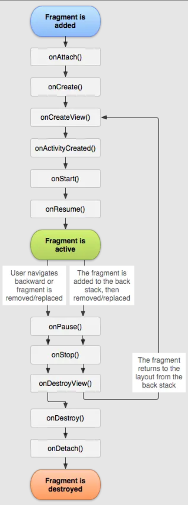
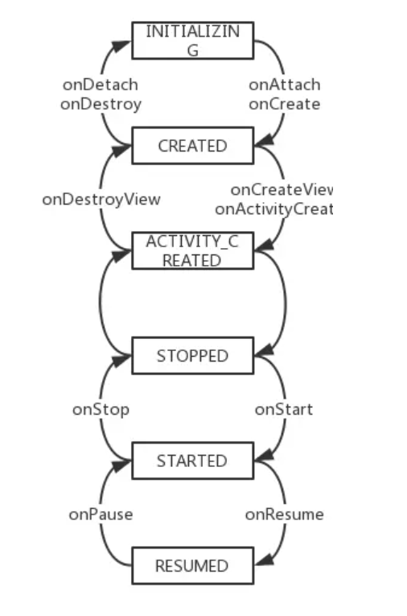

# 1 `Fragment`的生命周期  

## 1.1 `Fragment`生命周期概述  

  
<br/>


`Fragment`的生命周期函数很多，但实际上内部只定义了6种有效状态  


```java
static final int INVALID_STATE = -1;   // Invalid state used as a null value.
static final int INITIALIZING = 0;     // Not yet created.
static final int CREATED = 1;          // Created.
static final int ACTIVITY_CREATED = 2; // The activity has finished its creation.
static final int STOPPED = 3;          // Fully created, not started.
static final int STARTED = 4;          // Created and started, not resumed.
static final int RESUMED = 5;          // Created started and resumed.
```

## 1.2 `Fragment`与`Activity`生命周期关联  
`Fragment`与`Activity`生命周期密切相关，`Activity`通过`FragmentManager`来管理所有`Fragment`，对应关系如下
| `Activity`生命周期阶段      | `FragmentManager`触发函数 | `Fragment`状态迁移路径                  | `Fragment`生命周期回调函数               |
|--------------------------|-------------------------|---------------------------------------|---------------------------------------|
| `onCreate`               | `dispatchCreate`        | `INITIALIZING` → `CREATED`               | `onAttach` → `onCreate`              |
| `onStart`                | `dispatchStart`         | `CREATED` → `ACTIVITY_CREATED` → `STOPPED` → `STARTED` | `onCreateView` → `onActivityCreated` → `onStart` |
| `onResume`<br>（实际是`onPostResume`） | `dispatchResume`       | `STARTED` → `RESUMED`                    | `onResume`                           |
| `onPause`                | `dispatchPause`         | `RESUMED` → `STARTED`                    | `onPause`                            |
| `onStop`                 | `dispatchStop`          | `STARTED` → `STOPPED`                    | `onStop`                             |
| `onDestroy`              | `dispatchDestroy`       | `STOPPED` → `ACTIVITY_CREATED` → `CREATED` → `INITIALIZING` | `onDestroyView` → `onDestroy` → `onDetach` |

转换关系图如下：  



# 2 `Activity`与`Fragment`的通信方式，`Fragment`之间如何进行通信  
1. 接口回调 `interface`+`callback`，适合处理`Fragment`向`Activity`传递事件，如按钮点击，需要`onDetach`中释放引用接口，防止内存泄漏  
2. `ViewModel`+`LiveData`，适用于`UI`共享状态管理  
3. 通过`Fragment.setArguments`，适用于`Fragment`初始化时，`Activity`向`Fragment`传递数据  
4. 通过`Fragment.setFragmentResult`，适用于`Fragment`向`Activity`、其他`Fragment`传递数据  
5. `EventBus` 事件总线，适用于跨组件通信  
6. `Activity`直接获取`Fragment`实例来调用具体方法，反之，`Fragment`也可以通过`getActivity`调用`Activity`，这样做并不规范，代码会变得特别耦合  

# 3 为什么使用`Fragment.setArguments(Bundle)`传递参数  
核心原因在于`Activity`重建时，通过`setArguments`方法设置的参数能够恢复  
```java
// Activity.java
@Override
protected void onSaveInstanceState(@NonNull Bundle outState) {
    super.onSaveInstanceState(outState);
    // 通过FragmentController保存Fragment状态
    mFragments.saveAllState();
}

// FragmentManager.java
void saveAllState() {
    // 保存Fragment状态到FragmentManagerState中
    FragmentManagerState fms = new FragmentManagerState();
    // 遍历所有Fragment，保存其状态到FragmentState数组
    fms.mActive = activeFragments.toArray(new FragmentState[0]);
}
```
`FragmentManager.saveAllState`会把每个`Fragment`状态封装成`FragmentState`对象，当`Activity`重建时恢复  
```java
// Activity.java
@Override
protected void onCreate(@Nullable Bundle savedInstanceState) {
    super.onCreate(savedInstanceState);
    // 恢复Fragment状态
    mFragments.restoreSaveState(savedInstanceState);
}

// FragmentManager.java
void restoreSaveState(@NonNull Parcelable state) {
    FragmentManagerState fms = (FragmentManagerState) state;
    // 遍历FragmentState数组，重新实例化Fragment
    for (FragmentState fs : fms.mActive) {
        Fragment f = fs.instantiate(mHost.getContext(), mFragmentFactory);
        f.setArguments(fs.mArguments);  // 关键：重新设置Arguments
        // 其他状态恢复...
    }
}
```

# 4 `FragmentPageAdapter`和`FragmentStatePageAdapter`区别以及使用场景  

| 特性                        | `FragmentPagerAdapter`                     | `FragmentStatePagerAdapter`               |
|-----------------------------|-----------------------------------------|-----------------------------------------|
| `Fragment`销毁方式            | 仅销毁视图（`detach`），保留`Fragment`实例  | 完全销毁`Fragment`实例（`remove`+状态保存） |
| 内存占用                    | 较高（所有页面常驻内存）                | 较低（仅保留当前及相邻页面）            |
| 状态保存                    | 由`Fragment`自身维护（实例未销毁）        | 通过`onSaveInstanceState`保存`Bundle`       |
| 适用场景                    | 少量静态页面（如标签页）                | 大量动态页面（如图库、电子书）          |

# 5 `Fragment`懒加载  
`Fragment`懒加载是一种延迟加载策略，旨在`Fragment`真正对用户可见时才开始加载数据、执行业务逻辑，避免`Fragment`过多，同时加载造成的资源竞争、卡顿等问题  

在`ViewPager`+`Fragment`体系中，默认会预加载相邻`Fragment`（通过`offscreenPageLimit`可以控制，最小值为1），此时即便`Fragment`不可见，仍然会执行`onResume`回调。这种预加载机制会导致一定程度的资源浪费，随着`Fragment`嵌套层级加深，这个问题会变得非常严重，所以需要对`Fragment`的加载时机进行特殊处理    

1. 传统方式`ViewPager`  
```java
@Override
public void setUserVisibleHint(boolean isVisibleToUser) {
    super.setUserVisibleHint(isVisibleToUser);
    if (isVisibleToUser && isResumed()) {
        // 对用户可见时加载数据
        loadData();
    }
}
```
这种方式需要手动判断`Fragment`的生命周期，在`ViewPager2`出来之后已经被抛弃了  

2. 使用`Lifecycle` 
监听`Fragment`的生命周期，在`onResume`时加载数据，用一个变量标记防止重复加载  
```java
class LifecycleAwareFragment : Fragment() {
    private val viewModel: MyViewModel by viewModels()

    override fun onViewCreated(view: View, savedInstanceState: Bundle?) {
        super.onViewCreated(view, savedInstanceState)
        lifecycle.addObserver(object : DefaultLifecycleObserver {
            override fun onResume(owner: LifecycleOwner) {
                if (!viewModel.isDataLoaded) {
                    viewModel.loadData()
                }
            }
        })
    }
}
```
3. 使用`ViewPager2`  
`ViewPager2`能够监听页面切换，使得当前`Fragment`被选中时才加载
```java
viewPager2.registerOnPageChangeCallback(object : ViewPager2.OnPageChangeCallback() {
    override fun onPageSelected(position: Int) {
        val fragment = adapter.getFragment(position)
        if (fragment is ModernLazyFragment) {
            fragment.loadDataIfNeeded()
        }
    }
})
```
`ViewPager2`保证`onResume`仅在可见时回调，因此也可以用`onResume`+控制变量的方法
```java
class ModernLazyFragment : Fragment() {
    private var isDataLoaded = false

    override fun onResume() {
        super.onResume()
        if (!isDataLoaded) {
            loadData()
            isDataLoaded = true
        }
    }

    private fun loadData() {
        // 加载数据
    }
}

```

# 6 `ViewPager`与`ViewPager2`区别  

1. `FragmentStateAdapter` 替代`FragmentStatePagerAdapter`，对生命周期有了更合理的管控， `PagerAdapter`被`RecyclerView.Adapter`替代  
2. 支持竖直滑动，禁止滑动  
3. `PageTransformer`用来设置页面动画，设置页面间距  
4. 预加载当`setOffscreenPageLimit`被设置为`OFFSCREEN_PAGE_LIMIT_DEFAULT`时候会使用`RecyclerView`的缓存机制  

# 7 `Fragment`嵌套问题  

1. 正确使用`FragmentManager`，在父`Fragment`中操作子`Fragment`时，需要调用`getChildFragmentManager`  
2. 布局优化，尽可能减少`View`嵌套，使用`merge`标签减少层级，延迟加载子`Fragment`内容  
3. 返回事件处理，子`Fragment`需拦截返回键，此时应该在`Activity`宿主中协调
```java
// 宿主Activity.java
@Override
public void onBackPressed() {
    if (!handleNestedFragmentsBack()) {
        super.onBackPressed();
    }
}
// 检查子Fragment是否消费返回事件
private boolean handleNestedFragmentsBack() {
    Fragment current = getChildFragmentManager().findFragmentById(R.id.container);
    return current instanceof ChildFragment && ((ChildFragment) current).onBackPressed();
}
```
4. `Fragment`间通信，避免直接引用子`Fragment`实例，使用更优雅的通信方式，如`ViewModel`，或者`Interface`+`callback`  
5. 避免`Fragment`嵌套过深