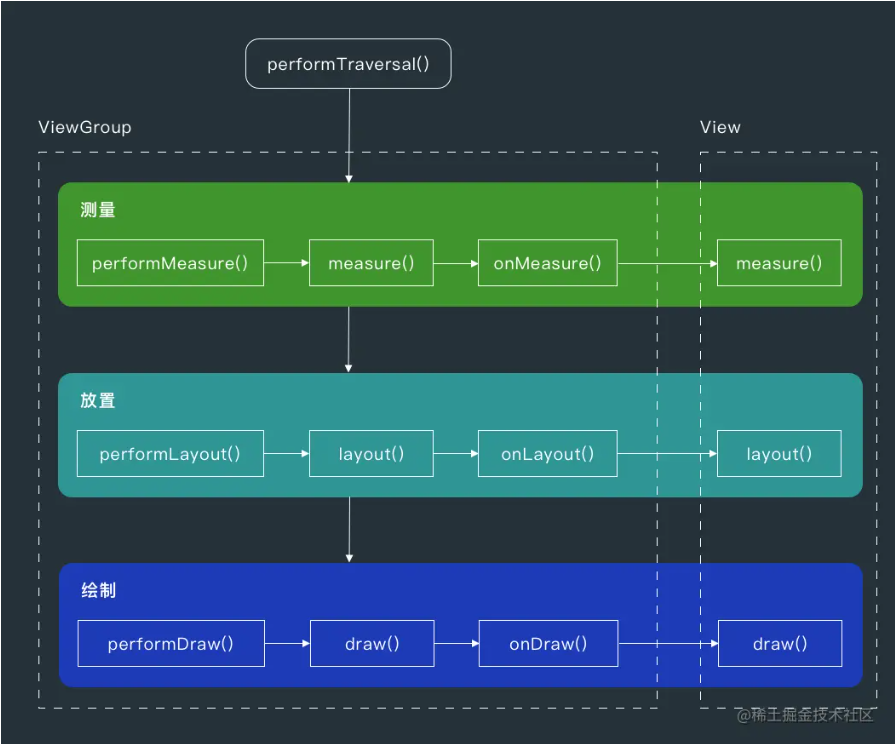

# 1 `View`绘制流程概述  

## 1.1 `Activity`触发`addView`的流程   
`ActivityThread.handleResumeActivity`->`WindowManagerImpl.addView`->`WindowManagerGlobal`->`addView`->`ViewRootImpl.setView`->`ViewRootImpl.requestLayout`->`ViewRootImpl.scheduleTraversals`->`ViewRootImpl.doTraversal`->`ViewRootImpl.performTraversals`->`View`绘制流程  

## 1.2 `View`绘制流程  



`View`绘制主要三个过程`onMeasure` `onLayout` `onDraw` ，分别对应测量、布局、绘制三个阶段，完成画多大、在哪画、画什么  

### 1.2.1 `Measure`过程  
`Measure`阶段的目的是确定每个`View`的尺寸（`width`、`height`），父`View`需要根据自身的约束条件和子`View`的`LayoutParams`，递归计算出所有子`View`的尺寸  

父`View`通过`measureChildWidthMargins`等方法，结合自身约束和子`View`的`LayoutParams`，生成子`View`的`MeasureSpec`，并调用子`View`的`measure`, 子`View`的`measure`方法被调用后，会先检测是否需要重新测量，然后调用`onMeasure`计算自身尺寸，最后保存测量结果（方便其他`View`调用，避免多次测量），父`View`在遍历子`View`的时候同时要考虑计算自身的`padding`和`margin` 

一个自定义`View`的`Measure`示例
```java
@Override
protected void onMeasure(int widthMeasureSpec, int heightMeasureSpec) {
    int totalWidth = 0;
    int maxHeight = 0;

    // 遍历所有子View
    for (int i = 0; i < getChildCount(); i++) {
        View child = getChildAt(i);
        if (child.getVisibility() == GONE) continue;

        // 测量子View（考虑margin）
        measureChildWithMargins(child, widthMeasureSpec, 0, heightMeasureSpec, 0);

        // 累加子View宽度（包括margin）
        totalWidth += child.getMeasuredWidth() 
            + ((MarginLayoutParams) child.getLayoutParams()).leftMargin
            + ((MarginLayoutParams) child.getLayoutParams()).rightMargin;

        // 计算最大高度（包括margin）
        maxHeight = Math.max(maxHeight, 
            child.getMeasuredHeight() 
            + ((MarginLayoutParams) child.getLayoutParams()).topMargin
            + ((MarginLayoutParams) child.getLayoutParams()).bottomMargin);
    }

    // 考虑父View的padding
    totalWidth += getPaddingLeft() + getPaddingRight();
    maxHeight += getPaddingTop() + getPaddingBottom();

    // 确定自身尺寸
    setMeasuredDimension(
        resolveSize(totalWidth, widthMeasureSpec),
        resolveSize(maxHeight, heightMeasureSpec)
    );
}
```

### 1.2.2 `Layout`过程  
`Layout`过程，即确定每个`View`在屏幕上的具体位置（`left`、`top`、`right`、`bottom`），由`performTraversals`触发，核心逻辑包括`View.layout`和`View.onLayout`  
```java
// View.java
public void layout(int l, int t, int r, int b) {
    // 1. 检查是否需要重新布局（新旧位置是否变化）
    if (l != mLeft || t != mTop || r != mRight || b != mBottom) {
        // 2. 设置新的坐标（left, top, right, bottom）
        setFrame(l, t, r, b);
        // 3. 调用onLayout()（ViewGroup需重写以布局子View）
        onLayout(changed, l, t, r, b);
        // 4. 触发布局完成的回调（如OnLayoutChangeListener）
        dispatchLayout();
    }
}

protected void onLayout(boolean changed, int left, int top, int right, int bottom) {
    // 默认空实现，ViewGroup必须重写此方法
}
```

父`View`需要在自己的`onLayout`中遍历所有的子`View`，根据`Measure`阶段的结果和布局规则，考虑`padding`和`margin`，调用子`View`的`layout`确定其位置，以`LinearLayout`为例
```java
// LinearLayout.java
@Override
protected void onLayout(boolean changed, int l, int t, int r, int b) {
    int currentLeft = getPaddingLeft(); // 起始位置考虑父View的padding
    for (int i = 0; i < getChildCount(); i++) {
        View child = getChildAt(i);
        if (child.getVisibility() == GONE) continue;

        // 1. 获取子View的测量尺寸
        int childWidth = child.getMeasuredWidth();
        int childHeight = child.getMeasuredHeight();

        // 2. 计算子View的位置（横向排列）
        int childLeft = currentLeft;
        int childTop = getPaddingTop(); // 顶部对齐
        int childRight = childLeft + childWidth;
        int childBottom = childTop + childHeight;

        // 3. 调用子View的layout()
        child.layout(childLeft, childTop, childRight, childBottom);

        // 4. 更新下一个子View的起始位置（考虑margin）
        currentLeft = childRight + ((MarginLayoutParams) child.getLayoutParams()).rightMargin;
    }
}
```

### 1.2.3 `Draw`过程  

`Draw`过程是把`View`呈现到屏幕上的最终步骤，包括六个核心步骤  
1.绘制背景；2.保存图层；3.绘制自身内容；4.绘制子`View`；5.绘制装饰器（前景、滚动条等）；6.恢复图层

```java
public void draw(Canvas canvas) {
    // 1. 绘制背景（若有）
    drawBackground(canvas);

    // 2. 保存图层（若需要），避免View绘制干扰其他View
    int saveCount = canvas.saveLayer(...);

    // 3. 绘制自身内容（onDraw()）
    onDraw(canvas);

    // 4. 绘制子View（dispatchDraw()）
    dispatchDraw(canvas);

    // 5. 绘制装饰（滚动条、前景等）
    onDrawForeground(canvas);

    // 6. 恢复图层（若保存过）
    if (saveCount >= 0) {
        canvas.restoreToCount(saveCount);
    }
}
```


参考：<https://juejin.cn/post/6904192359253147661>

# 2 `MeasureSpec`是什么  

`MeasureSpec`是一个32位整型值，它的高2位表示测量模式`SpecMode`，低30位表示某种测量模式下的规格大小`SpecSize`, `MeasureSpec`是`View`类的一个静态内部类， 用来说明如何测量这个`View`，有三种模式：
1. `EXACTLY`:精确测量模式，`View`宽高指定为`match_parent`或具体数值时生效，表示父`View`决定子`View`的大小，这种模式下`View`的测量值就是`SpecSize`的值  
2. `AT_MOST`:最大测量值模式，`View`宽高指定为`wrap_parent`生效，此时子`View`的尺寸不超过父`View`的最大尺寸  
3. `UNSPECIFIED`:不指定测量模式，父`View`没有限制子`View`的大小，子`View`可以是想要的任何尺寸，一般用于系统内部  

`MeasureSpec`通过将`SpecMode`和`SpecSize`打包成一个`int`值避免够多的内存消耗，`makeMeasureSpec`是打包方法，`getMode`和`getSize`是解包方法  

# 3 子`View`创建`MeasureSpec`创建规则是什么  

| 父`View`的`MeasureSpec` | 子`View`的`LayoutParams`       | 子`View`的`MeasureSpec`                    | 说明                                      |
|-------------------|---------------------|--------------------------------------|------------------------------------------|
| `EXACTLY`         | 固定值（如100dp）     | `EXACTLY` + 固定值                   | 子View尺寸固定                           |
|                   | `match_parent`      | `EXACTLY` + 父可用空间               | 子View填满父View剩余空间                 |
|                   | `wrap_content`      | `AT_MOST` + 父可用空间               | 子View尺寸不超过父View剩余空间           |
| `AT_MOST`         | 固定值（如100dp）     | `EXACTLY` + 固定值                   | 子View尺寸固定                           |
|                   | `match_parent`      | `AT_MOST` + 父可用空间               | 子View尺寸不超过父View剩余空间           |
|                   | `wrap_content`      | `AT_MOST` + 父可用空间               | 子View尺寸不超过父View剩余空间           |
| `UNSPECIFIED`     | 固定值（如100dp）     | `EXACTLY` + 固定值                   | 子View尺寸固定                           |
|                   | `match_parent`      | `UNSPECIFIED` + 父可用空间           | 子View尺寸无限制（如滚动布局测量子View） |
|                   | `wrap_content`      | `UNSPECIFIED` + 父可用空间           | 子View尺寸无限制（如滚动布局测量子View） |

# 4 自定义`View.wrap_content`不起作用的原因  

1. 未能正确处理`onMeasure`中的`AT_MOST`模式  
当子`View`的`LayoutParams`为`wrap_content`时，父`View`的`MeasureSpec=AT_MOST`时，此时，如果不做处理，子`View`会直接占满父`View`

```java
@Override
protected void onMeasure(int widthMeasureSpec, int heightMeasureSpec) {
    // 1. 计算View自身内容的尺寸（例如文本、图形的宽高）
    int contentWidth = calculateContentWidth();  // 自定义方法
    int contentHeight = calculateContentHeight();

    // 2. 根据MeasureSpec模式调整尺寸
    int width = resolveSize(contentWidth, widthMeasureSpec);
    int height = resolveSize(contentHeight, heightMeasureSpec);

    // 3. 保存测量结果
    setMeasuredDimension(width, height);
}

// 工具方法：根据MeasureSpec模式修正尺寸
private int resolveSize(int contentSize, int measureSpec) {
    int mode = MeasureSpec.getMode(measureSpec);
    int specSize = MeasureSpec.getSize(measureSpec);
    switch (mode) {
        case MeasureSpec.EXACTLY:
            return specSize; // 必须使用父View指定的尺寸
        case MeasureSpec.AT_MOST:
            return Math.min(contentSize, specSize); // 不能超过父View限制
        case MeasureSpec.UNSPECIFIED:
            return contentSize; // 无限制，直接使用内容尺寸
        default:
            return contentSize;
    }
}
```

# 5 在`Activity`中获取某个`View`的宽高有几种方法  

1. 使用`View.post`

`View.post`发生于`View`被添加后，此时`View`宽高已经确定，直接获取即可
```java
View view = findViewById(R.id.my_view);
view.post(() -> {
    int width = view.getWidth();
    int height = view.getHeight();
    Log.d("ViewSize", "Width: " + width + ", Height: " + height);
});
```

2. `Activity.onWindowFocusChanged`

当`View`首次完成布局，`Activity`获得焦点，该方法回调，此时可以准确测量宽高  
```java
@Override
public void onWindowFocusChanged(boolean hasFocus) {
    super.onWindowFocusChanged(hasFocus);
    // hasFocus表示首次获得焦点
    if (hasFocus) {
        View view = findViewById(R.id.my_view);
        int width = view.getWidth();
        int height = view.getHeight();
        Log.d("ViewSize", "Width: " + width + ", Height: " + height);
    }
}
```
注意：`onWindowFocusChanged`方法可能会反复回调，仅当`hasFocus==true`时才是首次完成布局  

3. 监听`ViewTreeObserver`  

该方法能准确获取全局`View.layout`时机

```java
View view = findViewById(R.id.my_view);
ViewTreeObserver observer = view.getViewTreeObserver();
observer.addOnGlobalLayoutListener(new ViewTreeObserver.OnGlobalLayoutListener() {
    @Override
    public void onGlobalLayout() {
        // 移除监听，避免重复调用
        view.getViewTreeObserver().removeOnGlobalLayoutListener(this);
        int width = view.getWidth();
        int height = view.getHeight();
        Log.d("ViewSize", "Width: " + width + ", Height: " + height);
    }
});
```

4. 手动`measure`，触发测量, 提前完成`View`绘制  

```java
View view = findViewById(R.id.my_view);
int widthSpec = View.MeasureSpec.makeMeasureSpec(0, View.MeasureSpec.UNSPECIFIED);
int heightSpec = View.MeasureSpec.makeMeasureSpec(0, View.MeasureSpec.UNSPECIFIED);
view.measure(widthSpec, heightSpec);
int measuredWidth = view.getMeasuredWidth(); // 测量宽度
int measuredHeight = view.getMeasuredHeight(); // 测量高度
```

这种做法会破坏`View`绘制流程，适合自定义`View`，不适合原生`View`  

5. 在`addOnLayoutChangeListener`回调中测量

```java
View view = findViewById(R.id.my_view);
view.addOnLayoutChangeListener(new View.OnLayoutChangeListener() {
    @Override
    public void onLayoutChange(View v, int left, int top, int right, int bottom, 
            int oldLeft, int oldTop, int oldRight, int oldBottom) {
        // 移除监听，避免重复调用
        view.removeOnLayoutChangeListener(this);
        int width = view.getWidth();
        int height = view.getHeight();
        Log.d("ViewSize", "Width: " + width + ", Height: " + height);
    }
});
```
适用于`View`变化比较频繁的场景，如动画导致的`View`大小变化  

# 6 为什么`onCreate`获取不到`View`的宽高  

`Activity`在执行完`onResume`之后才创建`ViewRootImpl`, 调用链如下：  
`startActivity`->`ActivityThread.handleLaunchActivity`->`onCreate`->完成`DecorView`和`Activity`的创建->`handleResumeActivity`->`onResume`->`DecorView`添加到`WindowManager`->`ViewRootImpl.performTraversals`->`View.measure`+`layout`+`draw`->`DecorView`自上而下遍历整个`View`树  

# 7 `View.post`和`Handler.post`的区别  

`View.post`一定在主线程中执行，调用时机在`View`被添加之后(`View.dispatchAttachedToWindow`), 在`View`被添加之后第一时间被执行  
`Handler.post`可以运行于任意线程，调用立即插入`MessageQueue`队列，等待`Looper.loop`触发调用

```java
// View.java
public boolean post(Runnable action) {
    final AttachInfo attachInfo = mAttachInfo;
    if (attachInfo != null) {
        // 情况1：View已附加到Window，直接使用主线程Handler
        return attachInfo.mHandler.post(action);
    }
    // 情况2：View未附加到Window，暂存任务到RunQueue
    getRunQueue().post(action);
    return true;
}

// 内部类HandlerActionQueue（即RunQueue）
private HandlerActionQueue mRunQueue;
public void post(Runnable action) {
    postDelayed(action, 0);
}
public void postDelayed(Runnable action, long delayMillis) {
    HandlerAction handlerAction = new HandlerAction(action, delayMillis);
    synchronized (mActions) {
        mActions.add(handlerAction);
    }
}

```
主要区别

| 特性             | **`View.post(Runnable)`**                                                 | **`Handler.post(Runnable)`**                                              |
|------------------|------------------------------------------------------------------------|-------------------------------------------------------------------------|
| **依赖的线程**    | 强制使用主线程的 `Handler`（通过 `AttachInfo` 获取）                        | 依赖关联的 `Looper`，可以是任意线程                                        |
| **执行时机**      | 若 `View` 未附加到 `Window`，任务暂存，附加后执行                           | 立即插入消息队列，不等待 `View` 生命周期状态                               |
| **生命周期安全性** | 自动关联 `View` 的附加状态，避免在未准备好时执行                           | 需手动管理生命周期（如防止 `Activity` 销毁后的泄漏）                       |
| **异常处理**      | 无需关心 `Looper` 是否存在（内部已处理）                                  | 若未绑定 `Looper`，直接抛出 `RuntimeException`                              |
| **典型使用场景**   | 在 `View` 布局完成后获取宽高或更新 `UI`                                     | 跨线程通信、定时任务等通用场景                                           |


# 8 `Android`绘制和屏幕刷新机制的原理 

# 9 `Choreography`原理  
# 10 什么是双缓冲  

通俗来讲就是有两个缓冲区，一个后台缓冲区和一个前台缓冲区，每次后台缓冲区接受数据，当填充完整后交换给前台缓冲，这样就保证了前台缓冲里的数据都是完整的。   
`Surface` 对应了一块屏幕缓冲区，是要显示到屏幕的内容的载体  
每一个 `Window` 都对应了一个自己的`Surface`，这里说的 `window` 包括 `Dialog`, `Activity`, `Status Bar`等，`SurfaceFlinger` 最终会把这些 `Surface` 在 `z` 轴方向上以正确的方式绘制出来（比如 `Dialog` 在 `Activity` 之上）  
`SurfaceView`的每个 `Surface` 都包含两个缓冲区，而其他普通 `Window` 的对应的 `Surface`则不是 

```java
// 子线程中的绘制循环
public void run() {
    while (isRendering) {
        Canvas canvas = null;
        try {
            // 1. 锁定后台缓冲区
            canvas = surfaceHolder.lockCanvas();
            // 2. 绘制内容（覆盖整个缓冲区以避免残留）
            canvas.drawColor(Color.BLACK); // 清空背景
            drawGameFrame(canvas);         // 绘制游戏内容
        } finally {
            // 3. 提交并交换缓冲区
            if (canvas != null) {
                surfaceHolder.unlockCanvasAndPost(canvas);
            }
        }
    }
}
```


# 11 什么是`SurfaceView`，为什么使用`SurfaceView`  

`SurfaceView`是`View`的子类，实现了`Parcelable`接口，内嵌了一个专门用于绘制的`Surface`，`SurfaceView`可以控制这个`Surface`的大小、位置，使用双缓冲机制，独立线程绘制`View`，`SurfaceView`虽然独立绘制视图，但是也可以作为宿主视图`ViewTree`的一个节点，参与到宿主`ViewTree`绘制流程  
从`SurfaceView`类的成员函数`draw`和`dispatchDraw`的实现可以看出，`SurfaceView`在其宿主窗口绘图表面上所做的操作就是将自己所占区域绘制成黑色，用户需要重写`onDraw`方法填充自己的内容  

`View`是通过刷新来重绘视图，系统通过发出`VSSYNC`信号来进行屏幕的重绘，刷新的时间间隔是16ms，如果界面更新频繁，绘制逻辑复杂，有可能会造成界面卡顿，采用`SurfaceView`就不存在这个问题

# 12 `View`和`SurfaceView`的区别  

`View`适用于主动更新的情况，`SurfaceView`适用于被动更新的情况，比如频繁刷新页面，`View`在主线程中对页面进行刷新，而`SurfaceView`则需要开启一个子线程进行刷新，`View`绘图时没有实现双缓冲机制，`SurfaceView`在底层机制中包含双缓冲机制  

# 13 `SurfaceView`为什么可以直接子线程绘制  

`View`之所以必须在主线程中更新，是因为`View`更新时调用一系列`ViewRootImpl.performXXX`方法，这些方法都会`checkThread`，这是`Android`单线程模型的约束  
`SurfaceView`绕过了传统的`View`模型，不参与`View`的绘制，使用独立的`Surface`，可以视为一个独立的图层，底层使用双缓冲技术，使`View`更新由子线程驱动，释放了主线程资源，适合一些无需计较资源消耗的高性能页面（如游戏、相机等）更新，代价是更高的内存占用、更高的系统资源消耗（如耗电）

# 14 `SurfaceView`、`TextureView`、`SurfaceTexture`、`GLSurfaceView`区别  

### `SurfaceView`、`TextureView`、`SurfaceTexture`、`GLSurfaceView` 对比

| **特性**                         | **`SurfaceView`**                        | **`TextureView`**                      | **`SurfaceTexture`**                  | **`GLSurfaceView`**                    |
|----------------------------------|----------------------------------|----------------------------------|----------------------------------|----------------------------------|
| **继承自**                        | `View`                           | `View`                           | `Object`                         | `SurfaceView`                     |
| **渲染方式**                      | 使用独立 `Surface` 进行绘制       | 作为 `GPU` 纹理绘制                 | 绑定到 `OpenGL` 纹理                | 使用 `OpenGL` 进行绘制               |
| **线程模型**                      | 独立线程，避免 `UI` 卡顿             | `UI` 线程                          | 独立线程                          | 独立线程                          |
| **是否支持 `View` 变换（旋转、缩放、透明）** | ❌ 不支持                         | ✅ 支持                          | ✅ 需要手动处理                   | ❌ 不支持                          |
| **是否支持与 `UI` 组件混合**          | ❌ 不支持，会被 `UI` 遮挡            | ✅ 支持                          | ✅ 需要手动集成                   | ❌ 不支持                          |
| **是否依赖硬件加速**                | ❌ 不依赖                         | ✅ 依赖                          | ❌ 不依赖                         | ❌ 不依赖                          |
| **适合渲染的内容**                 | 视频、2D 游戏、绘制动画            | 视频、相机预览、`UI` 动画            | `OpenGL` 纹理、相机预览              | `OpenGL` 3D 渲染、游戏               |
| **性能**                         | 高效，渲染不影响 `UI` 线程           | 略低，影响 `UI` 线程性能            | 高效，适用于 `OpenGL`               | 高效，专为 `OpenGL` 设计             |
| **使用 `OpenGL`**                   | ❌ 不能直接使用                    | ❌ 不能直接使用                    | ✅ 可与 `OpenGL` 结合               | ✅ 专门为 `OpenGL` 设计             |

# 15 `getWidth`和`getMeasureWidth`的区别  

`getMeasuredWidth`获取的是`setMeasuredDimension`方法的值，由父`View`的`MeasureSpec`和子`View`的`LayoutParams`共同确定，是一个理论值，有可能与最终可见`View`大小不同，在`measure`方法调用之后确定，通常在`onMeasure`方法中使用  

`getWidth`获取的是`mRight-mLeft`的值，这个值在`layout`之后确定，代表`View`最终可见宽度真实值，在布局结束后，通常调用这个方法

# 16 `invalidate`和`postInvalidate`的区别  

1. `invalidate`是直接触发的`View`重绘，需要在主线程中调用.`View`的`invalidate`递归调用父`View`的`invalidateChildInParent`，然后触发`peformTraversals`，会导致当前`View`重绘，由于`mLayoutRequested`设置为`false`，`onMeasrue`和`onLayout`不会回调，`onDraw`回调（仅在`View`大小发生变化时才会测量、布局，除非手动调用了`requestLayout`）  
2. `postInvalidate`可以在任意线程调用，把重绘调用转发给内部持有的主线程`Handler`执行，切回主线程，然后走`View.invalidate`流程  

# 17 `requestLayout`、`onLayout`、`onDraw`的联系  

`requestLayout`方法会导致调用`measure`和`layout`，不一定会触发`onDraw`，`requestLayout`会递归调用父窗口的`requestLayout`，直到`ViewRootImpl.perfomTraversals`, 由于`requestLayout`会把`mLayoutRequested`设置为`true`，这个布尔值会控制是否回调`onLayout`、`onMeasure`，所以`requestLayout`一定回调`onLayout`、`onMeasure`，这是职责分离设计思路的体现，先要触发`onDraw`，必须调用`invalidate`方法  

# 18 `LinearLayout`、`FrameLayout`、`RelativeLayout`哪个效率高  
`FrameLayout`>`LinearLayout`(无权重)>`LinearLayout`(有权重)>`RelativeLayout`  

1. `FrameLayout`  
仅需要将子`View`堆叠排列，所有子`View`测量和布局一次完成，适用于子`View`需要重叠显示（如`Fragment`容器）场景，无法处理复杂布局  

2. `LinearLayout`  
`LinearLayout`会按照排布方向进行测量，没有权重设置时，子`View`不存在依赖关系，只需要一次测量，如果有权重会有两次测量，适用于线性排列布局  

3. `RelativeLayout`  
子`View`之间存在依赖关系，可能会需要多次测量

# 19 `LinearLayout`的绘制流程  

`LinearLayout`是`View`的子类，绘制流程严格遵守`View`绘制流程，即`Measure`->`Layout`->`Draw`  

## 19.1 `Measure`

核心任务：计算自身和子`View`的尺寸  
步骤：1.确定排列方向（垂直 `VERTICAL`, 水平 `HORIZONTAL`）；2.遍历所有子`View`；3.处理权重（`weight`），如果设置了权重，那么需要测量2次，第一次先遍历所有子`View`，计算总尺寸，第二次根据权重分配尺寸  
```java
// LinearLayout.java
@Override
protected void onMeasure(int widthMeasureSpec, int heightMeasureSpec) {
    if (mOrientation == VERTICAL) {
        measureVertical(widthMeasureSpec, heightMeasureSpec);
    } else {
        measureHorizontal(widthMeasureSpec, heightMeasureSpec);
    }
}

private void measureVertical(int widthMeasureSpec, int heightMeasureSpec) {
    // 遍历子 View，计算总高度和最大宽度
    for (int i = 0; i < count; i++) {
        final View child = getVirtualChildAt(i);
        measureChildBeforeLayout(child, i, widthMeasureSpec, 0, heightMeasureSpec, totalWeight == 0 ? mTotalLength : 0);
        // 处理 weight 逻辑...
    }
    // 确定自身尺寸
    setMeasuredDimension(resolveSize(mTotalWidth, widthMeasureSpec), resolveSize(heightSize, heightMeasureSpec));
}
```


## 19.2 `Layout`  

核心任务：确定子`View`的位置  
步骤：1.确定起始位置，考虑自身的`padding`和`margin`；2.按方向排列；3.处理权重；4.处理子`View`的`gravity`  

```java
// LinearLayout.java
@Override
protected void onLayout(boolean changed, int l, int t, int r, int b) {
    if (mOrientation == VERTICAL) {
        layoutVertical(l, t, r, b);
    } else {
        layoutHorizontal(l, t, r, b);
    }
}

private void layoutVertical(int left, int top, int right, int bottom) {
    int childTop = mPaddingTop; // 起始位置
    for (int i = 0; i < count; i++) {
        final View child = getVirtualChildAt(i);
        // 确定子 View 的 left/top/right/bottom
        setChildFrame(child, childLeft, childTop, childWidth, childHeight);
        childTop += childHeight + lp.bottomMargin; // 更新下一个子 View 的起始位置
    }
}
```

## 19.3 `Draw`阶段  
核心任务：将`View`绘制到屏幕上  
步骤：1.绘制自身背景；2.调用每个子`View`的`draw`方法；3.绘制分割线  

```java
// LinearLayout.java
@Override
public void onDraw(Canvas canvas) {
    if (mDivider == null) return;

    if (mOrientation == VERTICAL) {
        drawDividersVertical(canvas);
    } else {
        drawDividersHorizontal(canvas);
    }
}

private void drawDividersVertical(Canvas canvas) {
    for (int i = 0; i < count; i++) {
        final View child = getVirtualChildAt(i);
        if (child != null && child.getVisibility() != GONE) {
            // 在子 View 下方绘制分割线
            drawVerticalDivider(canvas, child.getBottom() + params.bottomMargin);
        }
    }
}
```

# 20 自定义`View`的流程和注意事项  

1. 自定义`View`  
`onMeasure`：可以不重写，但是如果不重写就需要在外部指定宽高，一般会重写  
`onDraw`：如果有要画的内容就重写  
`onTouchEvent`：需要交互就重写  

2. 自定义`ViewGroup`  
`onMeasure`：必须重写，这里测量每一个子`View`，还有处理自己的尺寸  
`onLayout`：必须重写，对子`View`进行布局  
`onTouchEvent`：如果有触摸事件，那么重写  
`onDraw`：如果想在`ViewGroup`中画点东西，但是又不设置`background`，那么会画不出来，需要`setWillNotDraw=false`  

注意：如果自定义布局属性，需要在构造方法中获取属性值后及时调用`recycle`回收资源，`onDraw`和`onTouchEvent`都尽量避免创建对象，避免卡顿  

# 21 自定义`View`如何考虑机型适配  
1. 合理使用`warp_content`/`match_parent`  
2. 尽可能使用`ConstraintLayout`  
3. 针对不同的机型、屏幕`dp`，使用不同的布局文件  
4. 尽量使用9图  
5. 使用`dp`而非`sp`

# 22 自定义控件优化方案  

1. `onDraw`不要有耗时操作  
2. 避免过度绘制，移除不必要的背景，减少背景绘制（对于`ViewPager`+多个`Fragment`组成的首页界面，若每个`Fragment`都设有背景色，`ViewPager`没有设置的必要，可以移除，不然会多次绘制）  
3. 减少不必要的`View`嵌套，`UI`层级过高会导致卡顿  
4. 使用`clipRect`/`quickReject`给`Canvas`设置裁剪区，局部绘制


# 23 `invalidate`如何局部刷新  
`View.invalidate`的局部刷新可以通过指定脏区（`Dirty Rect`）来实现
```java
// 指定矩形区域（主推方案）
public void invalidate(Rect dirty)
public void invalidate(int left, int top, int right, int bottom)

// 指定单个坐标点（适用于点击反馈等场景）
public void invalidate(int l, int t, int r, int b)
```
原理：系统会将多次`invalidate`调用的区域合并成为一个最小包围矩形，在`Android 4+`开启硬件加速后，系统会自动进行区域裁剪，仅重绘脏区  

使用举例：
```java
public class CustomView extends View {
    public CustomView(Context context) {
        super(context);
        // 关键设置：允许View保存绘制内容（默认为true）
        setWillNotDraw(false);
    }

    // 示例：在触摸事件中局部刷新
    @Override
    public boolean onTouchEvent(MotionEvent event) {
        switch (event.getAction()) {
            case MotionEvent.ACTION_DOWN:
                // 计算需要刷新的区域（示例为以触摸点为中心的50x50区域）
                int size = 50;
                invalidate(
                    (int)event.getX() - size/2,
                    (int)event.getY() - size/2,
                    (int)event.getX() + size/2,
                    (int)event.getY() + size/2
                );
                return true;
        }
        return super.onTouchEvent(event);
    }

    @Override
    protected void onDraw(Canvas canvas) {
        // 获取当前脏区域
        Rect clipBounds = canvas.getClipBounds();
        if (clipBounds.isEmpty()) {
            return; // 无需要绘制的区域
        }

        // 仅绘制脏区域内的内容（关键优化）
        if (clipBounds.intersect(mDrawArea)) {
            // 执行局部绘制操作
            canvas.drawRect(clipBounds, mPaint);
        }
    }
}
```

# 24 `setContentView`加载流程  

`setContentView`是`Activity`构建`UI`的核心入口，调用链：`Activity.setContentView`->`PhoneWindow.setContentView`->`LayoutInflater.inflate`->`View`树构建->`DecorView`添加到`Window`  

## 24.1 `PhoneWindow`创建`Window`  
`PhoneWindow`是`Activity`窗口实现类，继承自抽象类`Window`，通过`WindowManager`添加、删除、更新，主要用来管理窗口装饰（如状态栏），内容容器创建，与`Activity`生命周期相同
```java
// Activity.java
public void setContentView(@LayoutRes int layoutResID) {
    getWindow().setContentView(layoutResID); // getWindow() 返回 PhoneWindow 实例
    initWindowDecorActionBar(); // 初始化 ActionBar（若有）
}
```
创建`DecorView`，并初始化

```java
// PhoneWindow.java
public void setContentView(int layoutResID) {
    if (mContentParent == null) {
        installDecor(); // 创建 DecorView 和 mContentParent
    }
    // 将用户布局添加到 mContentParent
    mLayoutInflater.inflate(layoutResID, mContentParent);
}
```
`installDecor`核心逻辑有两个：1.生成`DecorView`；2.初始化内容容器`mContentParent`.
```java
// installDecor简化版代码

mDecor = generateDecor(); // new DecorView(context)
mDecor.setWindow(this);

ViewGroup contentParent = generateLayout(mDecor);
mContentParent = contentParent; // 通常是 FrameLayout
```
`generateLayout`作用：1.根据窗口特性（主题、`Feature`）选择预定义布局；2.从主题中设置`windowBackground`/`windowFrame`等属性到`DecorView`；3.返回`contentParent`（id为`R.id.content`的`FrameLayout`


## 24.2 `LayoutInflater`解析布局
```java
// LayoutInflater.java
public View inflate(@LayoutRes int resource, @Nullable ViewGroup root) {
    XmlResourceParser parser = getResource().getLayout(resource);
    return inflate(parser, root, root != null);
}

// 实际解析方法
public View inflate(XmlPullParser parser, ViewGroup root, boolean attachToRoot) {
    // 递归解析 XML 节点
    while ((type = parser.next()) != XmlPullParser.END_DOCUMENT) {
        final View view = createViewFromTag(parent, name, context, attrs);
        // 构建 View 树
        if (root != null && attachToRoot) {
            root.addView(view, params);
        }
    }
    return root;
}
```
核心方法：
`createViewFromTag`:通过反射和抽象工厂来创建`View`对象  
递归处理子`View`节点，解析属性并设置`View`对象  

## 24.3 添加到`Window`
```java
// ActivityThread.handleResumeActivity()
final View decor = r.window.getDecorView();
decor.setVisibility(View.INVISIBLE);
ViewManager wm = a.getWindowManager();
wm.addView(decor, l); // 通过 WindowManager 添加 DecorView 到屏幕
```

# 25 `View`、`DecorView`、`Window`之间的关系

