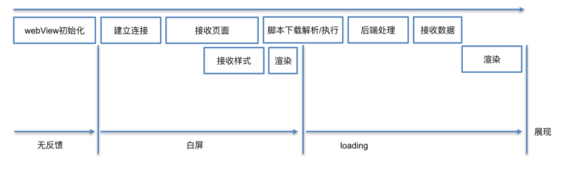
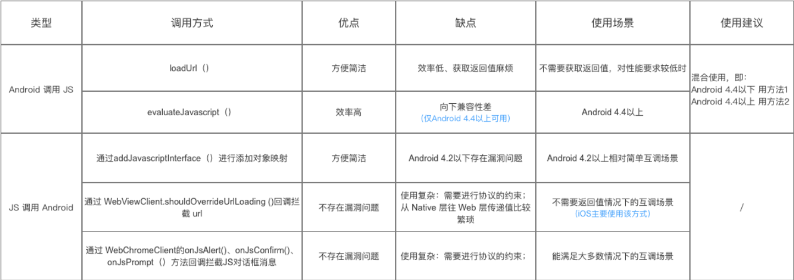

# 1 如何提高WebView的加载速度  


WebView加载优化是一个涉及前端、客户端、服务端，横跨网络、渲染、资源管理的系统性大工程

# 1.1 优化思路
客户端优化手段围绕以下两个点进行  
预加载WebView  
预加载WebView的同时请求H5页面数据  

# 1.2 客户端常见的方法  

1. 全局WebView+预加载WebView  

在使用WebView之前提前启动一个全局的WebView，减少WebView自身启动时间
```java
// 全局单例预加载 WebView
public class WebViewPreloader {
    private static WebView sPreloadedWebView;

    public static void preload(Context context) {
        if (sPreloadedWebView == null) {
            sPreloadedWebView = new WebView(context);
            // 提前初始化内核（关键！）
            sPreloadedWebView.loadUrl("about:blank"); // 加载空白页触发内核初始化
        }
    }

    public static WebView getPreloadedWebView(Context context) {
        if (sPreloadedWebView == null) {
            preload(context);
        }
        return sPreloadedWebView;
    }
}

// 在 Application 或主 Activity 中预加载
WebViewPreloader.preload(getApplicationContext());

// 实际需要加载页面时复用
WebView webView = WebViewPreloader.getPreloadedWebView(context);
webView.loadUrl("https://example.com");
```
preload需要在主线程中调用，这样就需要一个相对空闲的预加载时机，避免因为WebView加载导致ANR，这个方案会导致内存开销增大，并不适用内存敏感性场景，同时需要注意context可能导致内存泄漏  

2. WebView数据预加载  

可以提前loadUrl，并隐藏WebView，在该页面需要打开时，再设置可见即可  
```java
WebView hiddenWebView = new WebView(context);
hiddenWebView.setVisibility(View.GONE); // 隐藏
hiddenWebView.loadUrl("https://example.com");

// 缓存这个WebView
hiddenWebView.setWebViewClient(new WebViewClient() {
    @Override
    public void onPageFinished(WebView view, String url) {
        // 页面加载完成，保存实例备用
        PreloadCache.savePreloadedWebView(view);
    }
});

// 需要打开时直接addView
WebView cachedWebView = PreloadCache.getPreloadedWebView();
if (cachedWebView != null) {
    // 替换当前视图中的 WebView
    containerView.addView(cachedWebView);
}
```
这个方案需要更高的内存开销，适用于高频打开的页面，但需要注意页面状态可能需要刷新（如登录态）

3. 本地资源加载  

部分资源如果动态化程度没有那么高，可以先由服务端接口下发给客户端，客户端存储到本地，然后在前端加载时替换成本地资源

```java
webView.setWebViewClient(new WebViewClient() {
    @Override
    public WebResourceResponse shouldInterceptRequest(WebView view, WebResourceRequest request) {
        String url = request.getUrl().toString();
        if (isLocalResource(url)) {
            return loadFromLocal(url); // 返回本地资源
        }
        return super.shouldInterceptRequest(view, request);
    }
});
```

# 1.3 其他优化方法  
1. DNS预解析  

DNS解析通常会在系统级别进行缓存，对于WebView的地址，可以在前端、客户端进行dns预解析，减少WebView解析查询DNS时间   

前端可以在HTML中添加如下代码  
```html
<link rel="dns-prefetch" href="https://cdn.example.com">
```
或者客户端主动进行一次网络请求（不推荐）   
```kotlin
CoroutineScope(Dispatchers.IO).launch {
    okHttpClient.newCall(Request.Builder().url("https://cdn.example.com").head().build()).execute()
}
```
2. 服务端分块传输trunk

# 2 WebView与JS交互手段  

## 2.1 Android官方方案

对于Android调用JS代码的方法有2种：

通过WebView的`loadUrl`   
通过WebView的`evaluateJavascript`  
```java
// 因为evaluateJavascript方法在 Android 4.4 版本才可使用，所以使用时需进行版本判断
if (version < 18) {
    // callJS是前端代码中的方法名
    mWebView.loadUrl("javascript:callJS()");
} else {
    mWebView.evaluateJavascript（"javascript:callJS()", new ValueCallback<String>() {
        @Override
        public void onReceiveValue(String value) {
            //此处为 js 返回的结果
        }
    });
}
```

对于JS调用Android代码的方法有3种：  

通过`WebView`的`addJavascriptInterface`进行对象映射  
通过`WebViewClient`的`shouldOverrideUrlLoading`方法回调拦截 url  
通过`WebChromeClient`的`onJsAlert`、`onJsConfirm`、`onJsPrompt`方法回调拦截JS对话框alert、confirm、prompt消息   
```java

// 定义一个用于Js交互的类，隔离功能
public class AndroidtoJs extends Object {

    // 定义JS需要调用的方法
    // 被JS调用的方法必须加入@JavascriptInterface注解
    @JavascriptInterface
    public void hello(String msg) {
        System.out.println("JS调用了Android的hello方法");
    }
}

// 设置与Js交互的权限
webSettings.setJavaScriptEnabled(true);
// 通过addJavascriptInterface()将Java对象映射到JS对象
//参数1：Javascript对象名
//参数2：Java对象名
mWebView.addJavascriptInterface(new AndroidtoJs(), "test");//AndroidtoJS类对象映射到js的test对象
```


## 2.2 使用JsBridge  

JsBridge 是一个用于实现 Android 和前端 JavaScript 双向通信的第三方库  

```java
webView.registerHandler("getDeviceInfo", new BridgeHandler() {
    @Override
    public void handler(String data, CallBackFunction callback) {
        Log.d("JsBridge", "H5 调用了 getDeviceInfo，传递的数据：" + data);
        // 返回设备信息
        String response = "{\"model\": \"Samsung S23\", \"os\": \"Android 13\"}";
        callback.onCallBack(response);
    }
});

webView.callHandler("showMessageFromAndroid", "Hello from Android!", new CallBackFunction() {
    @Override
    public void onCallBack(String data) {
        Log.d("JsBridge", "H5 处理后的回调数据：" + data);
    }
});
```

# 3 WebView漏洞  

主要有3类漏洞  
任意代码执行漏洞  
密码明文存储  
域控制不严格  

参见：https://www.jianshu.com/p/3a345d27cd42   

1. 任意代码执行漏洞  

JS调用Android的可以通过`addJavascriptInterface`接口进行对象映射   
当JS拿到Android这个对象后，就可以调用这个Android对象中所有的方法，包括系统类（`java.lang.Runtime`类），从而进行任意代码执行  

解决：  
对于Android 4.2以前，需要采用拦截`prompt()`的方式进行漏洞修复  
让JS调用一Javascript方法：该方法是通过调用prompt把JS中的信息（含特定标识，方法名称等）传递到Android端；  
在Android的onJsPrompt中 ，解析传递过来的信息，再通过反射机制调用Java对象的方法，这样实现安全的JS调用Android代码  
对于Android 4.2以后，则只需要对被调用的函数以 @JavascriptInterface进行注解

2. 密码明文存储  

WebView默认开启密码保存功能
原因:WebView默认开启密码保存功能：`mWebView.setSavePassword(true) `开启后，在用户输入密码时，会弹出提示框：询问用户是否保存密码；  
如果选择”是”，密码会被明文保到`/data/data/com.package.name/databases/webview.db `中，这样就有被盗取密码的危险  
解决：关闭密码保存提醒：`WebSettings.setSavePassword(false)`

3. 域控制不严格  
当其他应用启动可以允许外部调用的Activity时，intent中的data直接被当作url来加载（假定传进来的url为`file:///data/local/tmp/attack.html` ），其他 APP 通过使用显式 ComponentName 或者其他类似方式就可以很轻松的启动该 WebViewActivity 并加载恶意url  

解决方案：  
对于暴露给外部调用的所有WebActivity，对所有传入的url进行域名校验，设置白名单逻辑；  
如无业务需要，禁用本地file加载
```java
setAllowFileAccess(false);
setAllowFileAccessFromFileURLs(false); 
setAllowUniversalAccessFromFileURLs(false);
```


