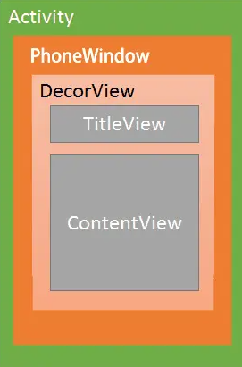

# 1 什么是Window  

Window是Android界面系统的基石，它连接应用逻辑与底层显示机制，管理视图的层级、渲染和交互，包含了View以及对View的管理，是一个抽象类，具体实现类一般为PhoneWindow，内部持有DecorView，通过WindowManager创建，并通过WindowManager将DecorView添加进来

# 2 什么是WindowManager  

WindowManager是一个接口，只有添加、删除和更新三个方法，具体实现类为WindowManagerImpl，WMI通过WindowManagerGlobal代理实现addView，最终调用到ViewRootImpl的setView使ViewRoot和DecorView关联，如果要对Window进行添加和删除，就需要使用WindowManager，具体的工作由WMS来处理，WindowManager和WMS的通信由Binder来实现，实现逻辑在WindowManagerGlobal中

# 3 什么是DecorView  

DecorView是继承自FrameLayout的子类，它可以被认为是Android视图树的根节点View，一般情况下内部包含一个竖着的LinearLayout，在这个LinearLayout里面有上下2个部分，上面是ViewStub，一般放标题栏（根据Theme设置），下面是内容栏（即ContentView，对应android.R.id.content， Activity.setContentView就是添加到此处）



# 4 Activity、View、Window三者之间的关系  

Activity并不负责控制视图，只负责页面生命周期和事件分发  
Activity内部持有了Window，Window是视图承载器，内部持有一个DecorView，Window主要作用是抽象界面容器，负责管理视图层级、视图属性，连接系统服务  
DecorView是View的根布局，setContentView被添加到DecorView中，View负责UI的具体细节实现  

# 5 DecorView什么时候被WindowManager添加到Window中  

一般而言，在Activity.onCreate中调用setContentView，在onResume中View被添加到Window中，核心逻辑在ActivityThread.handleResumeActivity  
```java
// ActivityThread.java
final void handleResumeActivity(...) {
    // 触发 onResume()
    ActivityClientRecord r = performResumeActivity(...);
    if (r.activity.mVisible) {
        // 获取 WindowManager 并添加 DecorView
        ViewManager wm = a.getWindowManager();
        wm.addView(decorView, window.getAttributes());
    }
}
```