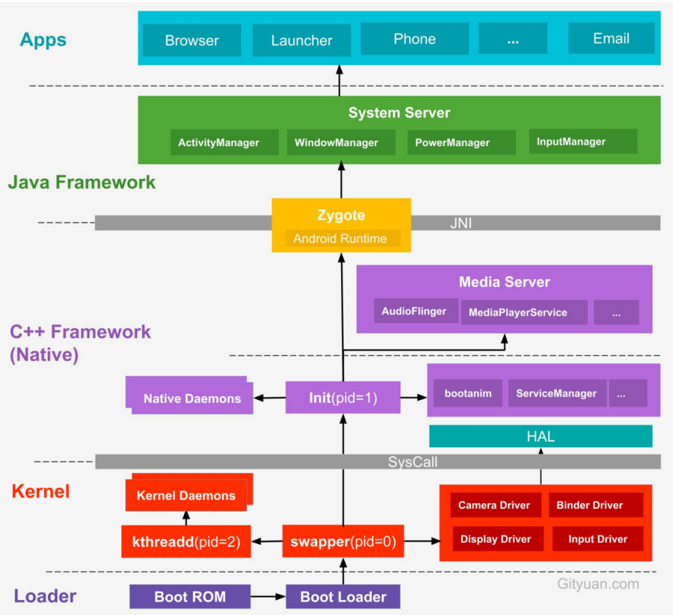

# 1 Android系统启动流程  

Android系统分为应用层、framework层、系统运行库层（Native）、Linux内核层，启动按照Loader->kernel->framework->Application来进行的  

1. BootLoader引导  

当电源被按下之后，引导芯片代码从ROM开始执行，BootLoader引导程序把操作系统映像文件拷贝到RAM中，然后跳转到它的入口执行，启动Linux内核  

Linux kernel内核启动，执行加载驱动等操作  

当内核启动完成后，启动init进程，作为第一个系统进程，init进程从内核态转为用户态  

2. init进程启动  

fork出ServiceManager子进程，ServiceManager主要用于管理我们的系统服务，内部存在一个Service服务列表，这个列表中存储的就是那些已经注册的系统服务  

解析init.rc配置文件并启动Zygote进程  

3. Zygote进程启动  

Zygote的主要作用就是孵化其他应用进程，所有的应用进程都是由Zygote进程fork出来的  

创建SystemServer进程，在Zygote进程启动之后，通过ZygoteInit的main方法fork出SystemServer进程  

4. SystemServer进程启动  

创建SystemServiceManager，它用来对系统服务进行创建、启动和生命周期的管理  

ServiceManager.startService启动各种系统服务，如AMS、WMS和PMS等，调用ServiceManager.addService，将这些服务注册到ServiceManager  

启动桌面进程，这样才能让用户看见手机界面  

5. Launcher进程启动  

开启系统Launcher程序来完成系统界面的加载和显示  

  

 

# 2 SystemServer、ServiceManager、SystemServiceManager的关系  

`SystemServer`是Android系统的核心进程（`system_server`），负责启动和管理所有的关键系统服务，如AMS、WMS等，由Zygote进程fork  

`ServiceManager`是Android Binder机制的全局服务注册中心（独立进程`servicemanager`），提供系统服务的注册和查询，所有Binder服务都会在这里注册，启动早于`SystemServer`主要用于IPC  

`SystemServiceManager`是`SystemServer`内部工具类，本身不是一个进程，负责管理系统服务的生命周期  

# 3 孵化应用进程为什么要交给SystemServer，而是专门设计一个Zygote  

Zygote进程是所有Android进程的母体，包括system_server和各个App进程  

Zygote利用fork()方法生成新进程，对于新进程A复用Zygote进程本身的资源，再加上新进程A相关的资源，构成新的应用进程A  

应用在启动的时候需要做很多准备工作，包括启动虚拟机，加载各类系统资源等等，这些都是非常耗时的，如果能在Zygote里就给这些必要的初始化工作做好，子进程在fork的时候就能直接共享，那么这样的话效率就会非常高  

SystemServer进程中存在一堆系统服务，这些不能继承到应用进程中  

# 4 Zygote的IPC通信机制为什么使用socket，而不是Binder  

Zygote 使用 Socket 的核心原因是 ​保证 fork 时的单线程安全性和轻量化，而 Binder 的多线程模型和复杂状态管理与 Zygote 的需求不兼容。这一设计选择体现了 Android 在进程孵化场景中对稳定性、安全性和简洁性的权衡。

1. 避免多线程问题，确保fork安全  

Binder通信依赖多线程机制，而Zygote在fork子进程时必须保证单线程环境，如果Zygote使用Binder，内部的线程池可能导致fork子进程继承多线程状态，导致死锁  

Socket是单线程阻塞式通信，Zygote在poll或者select调用时处于简单的等待状态，fork不会受其他线程干扰，子进程状态干净  

2. 简化资源继承、降低开销  

fork的写时拷贝（Copy-on-Write）特性，子进程会继承父进程的文件描述符（包括Socket），但Binder的上下文无法安全继承  

Binder驱动维护了进程间通信的复杂性（Binder线程池、Binder引用计数），高度依赖运行时状态，直接继承可能导致子进程状态混乱  

3. 轻量级安全控制  

Zygote 的 Socket（如 zygote 或 usap Socket）通过文件系统权限（如 selinux 或文件 owner）限制访问，只有特定进程（如 SystemServer）可以连接  

Binder 需要注册服务到 ServiceManager，并通过 Binder.getCallingUid() 等接口动态校验权限。这对 Zygote 的简单需求（仅接受来自 SystemServer 的 fork 请求）显得冗余

