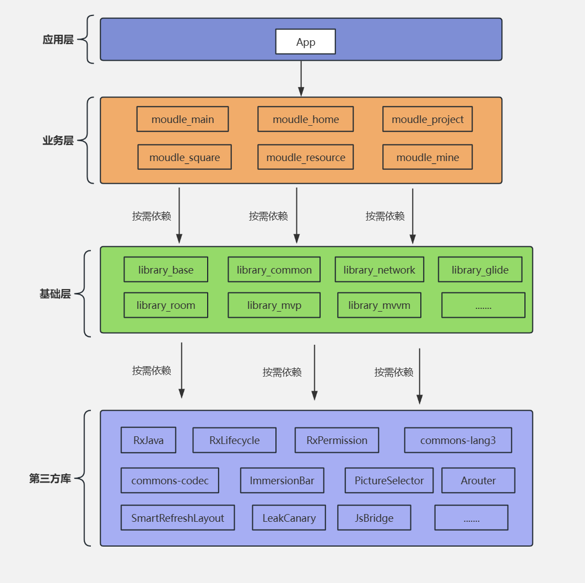

# 1 什么是模块化  

原本一个app模块提供所有功能即可，但是当业务量大到一定程度时，所有代码放在一起就会非常耦合了，可维护性会变得非常差，这个时候就需要将代码重新组织分类，把业务代码、基础模块代码按照不同的module拆分，定义好模块依赖关系和访问接口，实现模块间低耦合，模块内高内聚，这是符合软件工程设计思路的经典实现方案  

 
<br/>

# 2  什么是组件化  

组件化，去除模块间的耦合，使得每个业务模块可以当做独立App存在，对于其他模块没有直接依赖关系，此时业务模块成为了业务组件，如支付宝SDK  

1. 什么时候考虑组件化？  

组件提供完整功能，可以独立运行或者部署，具有极大的独立性和可复用性  
当业务需要跨项目复用，比如多个项目复用登录业务，那么登录可以单独作为一个独立可运行单元存在  

2. 组件化和模块化的区别是什么？  

模块化核心目的是业务解耦、代码分层，物理形态上是project的一个module:library，模块间允许依赖，模块通信通过预留接口，适合中小型项目  

组件化是模块化更高级的形态，核心目标是业务解耦、独立开发、动态部署，物理形态上是project的一个module:library/application, 模块间不允许依赖，模块通信一般通过路由框架，可以独立运行和部署, 适合超大型项目多团队并行开发  

# 3 组件化的优点和方案  

加快编译速度，每一个业务功能都是一个单独的工程，可独立编译运行  

提高团队协作效率，解耦使得组件之间相互不打扰，组件内部代码相关性极高，团队中每个人有自己的责任组件，不会影响其他组件，降低团队队员熟悉项目的成本，对测试而言，只需要重点测试改动组件即可，无需每次都要全部回归测试  

实现方案参考：https://juejin.cn/post/6881116198889586701#heading-26


# 4 组件独立调试  

1. 修改module的build.gradle文件配置  

```java
// 组件模块的 build.gradle
if (isModule.toBoolean()) { // isModule 是 gradle.properties 中的布尔值
    apply plugin: 'com.android.application'
} else {
    apply plugin: 'com.android.library'
}

android {
    defaultConfig {
        if (isModule.toBoolean()) {
            applicationId "com.example.user" // 独立运行时的包名
        }
        // ...
    }
}
```

2. gradle.properties中配置全局开关  
```java
# gradle.properties
isModule=false  # 默认集成模式（库）
```

3. 配置module目录下的AndroidManifest.xml文件，一般而言这个文件只有一个，新增module需要手动配置  
```markdown
- src/
  - main/          # 集成模式清单
    - AndroidManifest.xml
  - module/        # 独立运行模式清单
    - AndroidManifest.xml
```

在`build.gradle`中动态指定清单文件路径：
```groovy
android {
    sourceSets {
        main {
            if (isModule.toBoolean()) {
                manifest.srcFile 'src/module/AndroidManifest.xml'
            } else {
                manifest.srcFile 'src/main/AndroidManifest.xml'
            }
        }
    }
}
```  

4. 配置Gradle  
```groovy
// 根 build.gradle 中添加任务（可选）
task toggleMode {
    doLast {
        def isModule = project.properties['isModule'] == 'true'
        new File(project.rootDir, "gradle.properties").text = "isModule=${!isModule}"
    }
}
```
# 5 组件间通信  

1. 对外暴露接口  
2. 使用路由框架 ARouter、WMRouter等  
3. 依赖注入，通过Dagger/Hilt等将接口实现注入的调用方  

# 6 Application动态加载  


## 6.1 什么是Application动态加载？  


## 6.2 实现方案