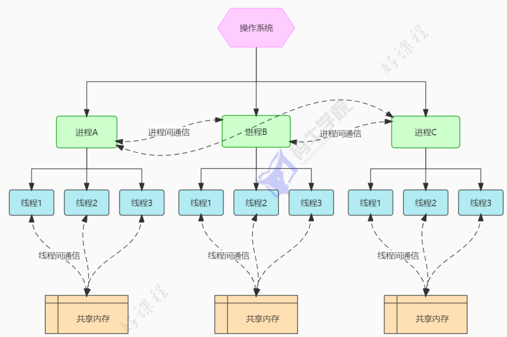
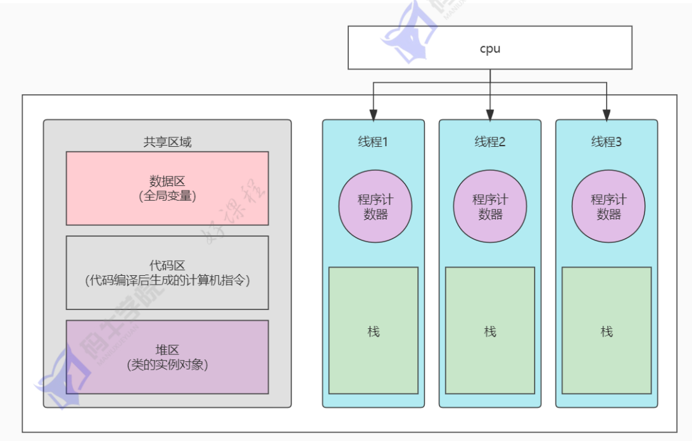

# 1 synchronized 

synchronized是Java解决并发情况下数据同步访问的一个很重要的关键字，当多个线程环境下，需要保证一个共享资源在同一时间只能被一个线程访问，可以使用synchronized关键字对类、对象、代码块加锁  

## 1.1 基本用法

1. 修饰实例方法（锁对象）  
```java
public synchronized void doSomething(){
    //临界区
}

// 等价写法
public void doSomething(){
    synchronized(this){
        // 临界区
    }
}
```

2. 修饰静态方法（锁类）
```java
// MyClass.java
public static synchronized void doSomething(){
    // 临界区
}

//等价写法
public static void doSomething(){
    synchronized(MyClass.class){
        // 临界区
    }
}
```

3. 修饰代码块（自定义锁对象）
```java
private final Object lock = new Object();

public void method() {
    synchronized (lock) {
        // 临界区
    }
}
```

## 1.2 底层原理  

1. 同步方法  

方法级（包括静态方法）的同步是隐式的，同步方法常量池中会有一个ACC_SYNCHRNZED标志，当某个线程访问方法时，先检查是否有ACC_SYNCHRNZED，如果有，先获取监视器锁（Monitor），执行方法后释放该监视器，其他线程如果没有获得该监视器，那么会被阻塞。如果方法在执行过程中，发生异常而导致方法没有执行完，同样会释放监视器  

每个对象都有一个Monitor（静态方法也有对应的全局唯一类对象，例如`MyClass.class`是`Class<MyClass>`对象），synchronized通过对象的Monitor来加锁、释放锁，Monitor是JVM的锁机制，本质上依赖于操作系统mutex  

2. 同步代码块  

代码块同步通过monitorenter和monitorexit两个指令实现，对应加锁、释放锁，每个对象维护一个记录被锁次数的计数器，未被锁定的对象的计数器为0，当一个线程获取到锁，monitorenter执行，计数器+1，释放时执行monitorexit，计数器-1，其他线程可以获得锁  

代码块的加锁、释放锁同样是通过Monitor，这一点和方法级同步相同  

# 2 volatile  

volatile通常被称为轻量级synchronized，只能保障可见性、有序性，不能保障原子性，适用于0个或1个线程写、多个线程同时读的场景，或者成员自身能保证原子性（如布尔型），volatile只能用于修饰变量，无法修饰方法以及代码块  

## 2.1 volatile原理  

CPU和内存之间通常有多级缓存，存在缓存数据不一致的问题  

但是对于volatile变量，当进行写操作时，JVM会向处理器发送一条Lock指令，将这个缓存中的变量回写到系统主存中，为了保证多处理器间多个缓存之间数据一致性，这里面有一个缓存一致性协议  

**缓存一致性协议**  

每个处理器通过嗅探在总线上传播的数据来检测自己缓存的信息是不是过期了，当处理器发现自己缓存行对应的内存地址被修改了，就会将当前处理器的缓存行设置为无效状态，当处理器需要对这个无效数据访问时，会先从系统内存中读取数据到缓存中  

所以，如果一个变量被volatile修饰，在每次数据变化之后，其值都会被强制刷新入主存，这就保证了volatile的可见性  

**内存屏障（Memory Barrier）**  

Java内存模型规定编译器和CPU在volatile变量进行读写操作时插入内存屏障，以保障有序性，即禁止指令重排  

如果没有禁止指令重排，多线程环境下可能会因为JVM优化导致指令执行顺序发生变化，比如：  
```java
Object object = new Object(); // 正常顺序：1.分配内存；2.初始化对象；3.引用地址赋值给object
```  

实际有可能会被优化为：  
1. 分配内存，产生引用地址  
2. 引用地址赋值给object  
3. 初始化对象  

那么就有可能有线程在执行了`Object object = new Object()`语句之后，拿到的object对象未完成初始化，直接使用会异常  

经典的DCL单例就是采用这种方式使用volatile  

```java
// 单例模式中 volatile 的典型用法
class Singleton {
    private static volatile Singleton instance;

    public static Singleton getInstance() {
        if (instance == null) { // 第一次检查（避免加锁）
            synchronized (Singleton.class) {
                if (instance == null) { // 第二次检查（线程安全）
                    instance = new Singleton(); // 禁止重排！
                }
            }
        }
        return instance;
    }
}
```

# 3 开启线程的几种方式  

1. 继承Thread类  

```java
class MyThread extends Thread {
    @Override
    public void run() {

    }
}

MyThread myThread = new MyThread();
        myThread.start();
```

2. 实现Runnable接口 

```java
Thread thread = new Thread(new Runnable() {
        @Override
        public void run() {
                
        }
    });
thread.start();

//Lambda表达式简写
new Thread(()->{}).start();

```

3. FutureTask+Callback接口  

```java
FutureTask<Integer> task = new FutureTask<>(new MyCallback());
Thread thread = new Thread(task);
thread.start();


class MyCallback implements Callable<Integer> {
    @Override
    public Integer call() throws Exception {
        //　业务逻辑
        return 0;
    }
}
```

和Runnable最大的区别是，Callable带返回值  

4. ExecutorService线程池  

```java
import java.util.concurrent.ExecutorService;
import java.util.concurrent.Executors;

// 创建线程池
ExecutorService executor = Executors.newFixedThreadPool(5);

// 提交任务
executor.execute(() -> {
    // 线程执行的代码
});

// 或者提交Callable任务
Future<String> future = executor.submit(() -> {
    // 线程执行的代码
    return "执行结果";
});

// 关闭线程池
executor.shutdown();

```

一般不推荐直接new Thread，而是通过线程池来管理Thread对象


# 4 线程和进程的区别？为什么要有线程，而不仅仅有进程？  

 

进程是操作系统资源分配的基本单位，而线程是处理器任务调度和执行的基本单位  

每个进程都有独立的地址空间，进程切换会有比较大的开销，线程可以看做轻量级进程，统一进程内，线程共享进程的地址空间，每个线程都有独立运行栈和程序计数器，线程切换开销比较小  

  

线程的栈区、程序计数器、栈指针以及函数运行使用的寄存器是线程私有的，以上统称为线程上下文，操作系统调度线程时能够随时阻塞线程并唤醒，依靠的就是上下文信息  

线程增加并发度，更有效的利用CPU资源


# 5 run和start方法的区别  

run会在Thread对象所在线程直接运行Runnable对象的run方法，不会创建新的线程  

start方法本质上调用了native方法start0, 这个方法会创建新的子线程，并调用run方法  

# 6 如何控制某个方法允许并发访问线程的个数  

1. 使用信号量Semaphore（最优解）  

```java
import java.util.concurrent.Semaphore;

public class ConcurrentControl {
    private final Semaphore semaphore = new Semaphore(5); // 允许5个线程并发访问
    
    public void controlledMethod() throws InterruptedException {
        semaphore.acquire(); // 获取许可
        try {
            // 受保护的代码块
            System.out.println(Thread.currentThread().getName() + " 正在执行");
            Thread.sleep(1000);
        } finally {
            semaphore.release(); // 释放许可
        }
    }
}
```

2. 使用CountDownLatch  

```java
import java.util.concurrent.CountDownLatch;

public class LatchControl {
    private static final int MAX_CONCURRENT = 5;
    private final CountDownLatch latch = new CountDownLatch(MAX_CONCURRENT);
    
    public void controlledMethod() throws InterruptedException {
        if (latch.getCount() == 0) {
            // 已达到最大并发数，等待
            latch.await();
        }
        
        latch.countDown();
        try {
            // 受保护的代码块
            System.out.println(Thread.currentThread().getName() + " 正在执行");
            Thread.sleep(1000);
        } finally {
            latch.countUp(); // Java 17+
        }
    }
}
```  

CountDownLatch是 Java 5就引入的，但只有countDown方法，无法恢复计数，而countUp方法需要Java 17  

3. 手动维护计数器  

```java
public class SimpleCounterControl {
    private static final int MAX_CONCURRENT = 5;
    private static volatile int currentCount = 0;
    
    public synchronized void controlledMethod() throws InterruptedException {
        while (currentCount >= MAX_CONCURRENT) {
            wait();
        }
        
        currentCount++;
        try {
            // 受保护的代码块
            System.out.println(Thread.currentThread().getName() + " 正在执行");
            Thread.sleep(1000);
        } finally {
            synchronized (this) {
                currentCount--;
                notifyAll();
            }
        }
    }
}

```

手写很麻烦，且不适用于复杂场景，仅作为手撸代码试炼  

# 7 Java中wait和sleep的区别  

# 7.1 wait

wait方法作用是让获取到锁的线程释放锁并进入等待状态（WAITING），如果没有锁直接调用wait，会报InterruptedException异常，通常和synchronized配合使用    

wait阻塞的线程需要notify方法显式唤醒  

wait是根类Object的方法，可以指定timeout阻塞事件，不然会无限制等待，主要用途是线程协作  

```java
// 生产者-消费者模型
boolean isReady = true;

// 线程1，假设线程1先执行
synchronized(lock){  // t1:线程1持有锁
    while(isReady){  // t2:线程1进入循环条件判断
        lock.wait()  // t3：线程1wait方法，进入WAITING状态，并释放锁，如果被唤醒，等线程2释放锁之后，重新获取锁，继续往下循环
    }
    
    // 阻塞条件不成立，线程继续处理业务逻辑
    ...
}   // t4:线程1释放锁

//线程2，假设线程2后执行
synchronized(lock){ // t1：lock如果已经被锁了，等待锁释放
    isReady = false // t2: lock锁释放，线程2持有锁
    lock.notifyAll()// t3：唤醒所有WAITING状态的线程
} // t4:线程2释放锁

```

# 7.2 sleep  

sleep方法是Thread的静态方法  

sleep方法会让当前线程阻塞，进入TIMED_WAITING状态，如果线程已经锁了，这个锁不会释放  

sleep方法必须指定睡眠时间  

sleep没有唤醒方法，时间到了自动结束，如同他的名字一样，让线程睡一阵子，常用来模拟延迟  

# 8 谈谈wait和notify关键字的理解  

都是Object的final方法  

wait，线程进入WAITING状态，释放对象锁  

notify，随机唤醒队列中的一个WAITING线程

# 9 什么导致线程阻塞  

1. 线程主动阻塞，如调用wait、sleep方法    
2. 线程等待获取同步锁，进入阻塞状态  
3. I/O阻塞，线程等待IO结果，如InputStream.read、Socket.read调用  

# 10 线程如何关闭  

1. 对于Thread对象，直接调用Thread.interrupt方法，但是这个方法并不会立即终止线程，而是改变标志位，需要线程主动监测标志，并处理InterruptedException异常  
2. 线程池关闭，ExcutorService.shutdown  
3. 手动维护一个布尔型标记位，控制线程逻辑  

# 11 Java中的同步方法有哪些  

1. 变量使用volatile修饰，用于多个线程读的情况  
2. 方法、代码块使用synchronized修饰，通过加锁实现同步  
3. 使用java.util.concurrent中线程安全的集合类  
4. 使用ThreadLocal管理变量  
5. 使用原子类（Atomic）


# 12 什么是锁升级

synchronized底层实现依赖对象头中的Mark Word和JVM监视器（Monitor）锁机制，JVM对锁的获取和释放设计了多种状态，在竞争激烈程度不同的情况下使用不同的锁，这就是锁升级，注意，锁只能升级，不能降级    

1. 无锁  

默认状态，此时没有线程使用锁  

2. 偏向锁  

第一次线程访问synchronized代码块，会将对象的锁记录偏向当前线程  

如果后续没有其他线程竞争，那么无需升级，否则继续升级  

3. 轻量级锁  

多个线程交替使用锁（无真正并发），适合线程交替执行的场景  

4. 重量级锁  

多个线程并发产生竞争，触发OS级别的Monitor机制，线程会被阻塞，性能较低  

# 13 ReentrantLock  

ReentrantLock常见用法：中断锁（interruptible lock）、定时锁（timed lock） 和 公平锁（fair lock）


1. 中断锁  

中断锁允许一个线程在等待锁的过程中被中断，避免死等  

synchronized 是不可中断的，如果线程在等待锁，只能无限等下去。而 ReentrantLock.lockInterruptibly() 支持中断  

```java
ReentrantLock lock = new ReentrantLock();

Thread t1 = new Thread(() -> {
    try {
        lock.lockInterruptibly(); // 可中断加锁
        System.out.println("Thread1 获得锁");
        Thread.sleep(10000); // 模拟耗时
    } catch (InterruptedException e) {
        System.out.println("Thread1 被中断");
    } finally {
        if (lock.isHeldByCurrentThread()) lock.unlock();
    }
});

Thread t2 = new Thread(() -> {
    try {
        Thread.sleep(1000); // 等t1先拿锁
        lock.lockInterruptibly(); // 等待锁可中断
        System.out.println("Thread2 获得锁");
    } catch (InterruptedException e) {
        System.out.println("Thread2 在等待锁时被中断");
    }
});

t1.start();
t2.start();

Thread.sleep(3000); // 等待一会后打断 t2
t2.interrupt();


//执行结果
Thread1 获得锁
Thread2 在等待锁时被中断

```


2. 定时锁  

指定时间尝试获取锁，如果超时未获得，就放弃  

synchronized 是“等到天荒地老”，而 ReentrantLock.tryLock(timeout) 可以设置时间  

```java
ReentrantLock lock = new ReentrantLock();

Thread t1 = new Thread(() -> {
    lock.lock();
    try {
        System.out.println("Thread1 获得锁，睡眠5秒");
        Thread.sleep(5000);
    } catch (InterruptedException ignored) {
    } finally {
        lock.unlock();
    }
});

Thread t2 = new Thread(() -> {
    try {
        System.out.println("Thread2 尝试获取锁，最多等2秒");
        if (lock.tryLock(2, TimeUnit.SECONDS)) {
            System.out.println("Thread2 获得锁");
            lock.unlock();
        } else {
            System.out.println("Thread2 获取锁超时，放弃");
        }
    } catch (InterruptedException ignored) {
    }
});

t1.start();
Thread.sleep(100); // 先启动 t1 拿锁
t2.start();


// 执行结果
Thread1 获得锁，睡眠5秒
Thread2 尝试获取锁，最多等2秒
Thread2 获取锁超时，放弃
```


3. 公平锁  

公平锁保证先等待的线程先获得锁（FIFO），避免“插队”  

synchronized 和 ReentrantLock 默认是非公平的，可能后来的线程直接抢锁成功  

ReentrantLock 提供构造参数 new ReentrantLock(true) 实现公平锁  

```java
ReentrantLock fairLock = new ReentrantLock(true); // 公平锁

Runnable task = () -> {
    String name = Thread.currentThread().getName();
    fairLock.lock();
    try {
        System.out.println(name + " 获得锁");
        Thread.sleep(500);
    } catch (InterruptedException ignored) {
    } finally {
        fairLock.unlock();
    }
};

for (int i = 0; i < 5; i++) {
    new Thread(task, "线程" + i).start();
}


// 执行结果
线程0 获得锁
线程1 获得锁
线程2 获得锁
线程3 获得锁
线程4 获得锁

```


# 14 线程池的几个核心参数  

```java
public ThreadPoolExecutor(
    int corePoolSize,               // 核心线程数
    int maximumPoolSize,            // 最大线程数
    long keepAliveTime,             // 非核心线程空闲存活时间
    TimeUnit unit,                  // keepAliveTime 的时间单位
    BlockingQueue<Runnable> workQueue, // 等待队列
    ThreadFactory threadFactory,    // 线程工厂
    RejectedExecutionHandler handler // 拒绝策略
)
```


| 参数名               | 类型                       | 说明                           |
| ----------------- | ------------------------ | ---------------------------- |
| `corePoolSize`    | int                      | 核心线程数（即使空闲也不会被回收）            |
| `maximumPoolSize` | int                      | 最大线程数（含核心+非核心）               |
| `keepAliveTime`   | long                     | 非核心线程在无任务时保持存活的时间            |
| `unit`            | TimeUnit                 | `keepAliveTime` 的时间单位，如秒、毫秒等 |
| `workQueue`       | BlockingQueue\<Runnable> | 任务等待队列，缓存未执行的任务              |
| `threadFactory`   | ThreadFactory            | 线程创建工厂，用于自定义线程名称、优先级等        |
| `handler`         | RejectedExecutionHandler | 任务无法执行时的拒绝策略                 |


常见任务队列`BlockingQueue`  

| 队列类型 | 类名                      | 特点           |
| ---- | ----------------------- | ------------ |
| 有界队列 | `ArrayBlockingQueue`    | 固定容量，先进先出    |
| 无界队列 | `LinkedBlockingQueue`   | 理论无限大（容易OOM） |
| 直接提交 | `SynchronousQueue`      | 不存储任务，直接交给线程 |
| 优先队列 | `PriorityBlockingQueue` | 可按优先级调度任务    |

常见拒绝策略`RejectedExecutionHandler`  

| 策略类                   | 行为                                 |
| --------------------- | ---------------------------------- |
| `AbortPolicy`（默认）     | 抛出 `RejectedExecutionException` 异常 |
| `CallerRunsPolicy`    | 调用线程直接执行该任务                        |
| `DiscardPolicy`       | 直接丢弃任务，不报错                         |
| `DiscardOldestPolicy` | 丢弃队列中最旧的任务，然后重试提交当前任务              |


扩展问题：线程池的工作原理、线程复用机制、任务调度细节、线程泄漏风险等，我可以为你详细展开