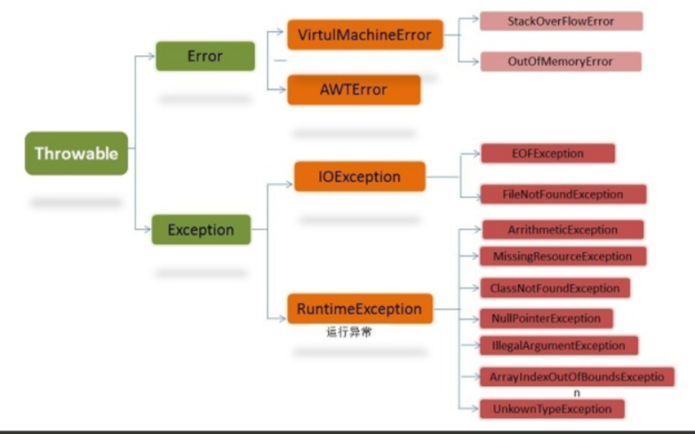

# 1 哪些情况下对象会被垃圾回收机制处理掉  

1. 引用链不可达  

对象在内存中，从任何GC Roots出发，无法通过引用链访问到它，这个对象就是待GC的垃圾对象  

比如说方法体内new的对象，在方法执行完之后，自动回收  

```java
void test() {
    Object obj = new Object(); // obj是局部变量，指向堆中的对象
}
// test()执行完后，obj出栈，堆上Object没有任何引用了 => 引用链断了 => 可以GC
```

也可以主动赋null，区别在于主动null可以更快的GC，无需等方法体执行完，适合大内存（大图片、大文件等）占用及时释放  

```java
public void loadLargeImage() {
    byte[] imageData = loadFromDisk(); // 加载一个很大的图片文件到内存
    
    processImage(imageData); // 使用imageData做点什么

    imageData = null; // **主动断开引用**

    // 后面还有很多逻辑，比如其他小数据的处理
    doOtherThings();
}

```

优化点：如果频繁new对象，可以考虑把对象缓存起来，小对象直接存，如果是Bitmap这种大对象，可以考虑用LRUCache策略，目的是减少频繁GC带来的性能损耗

2. 强引用断开后，弱引用、软引用、虚引用的回收  

- 强引用：正常new出来的对象，只要存在，就不回收  
- 弱引用（WeakReference）：GC时发现弱引用，直接回收  
- 软引用（SoftReference）：内存紧张时回收  
- 虚引用（PhantomReference）：任何时候都能回收，仅用于监听回收事件  

```java
import java.lang.ref.WeakReference;

public class Example3 {
    public static void main(String[] args) {
        Object obj = new Object();
        WeakReference<Object> weakRef = new WeakReference<>(obj);

        obj = null; // 断开强引用

        System.gc(); // weakRef指向的对象很快会被回收
        System.out.println(weakRef.get()); // 可能输出null
    }
}

```

3. 对象存在于可回收的数据结构里  

如WeakHashMap

4. 类卸载时，静态字段回收  

一个类的静态字段只有在类卸载时才可能被回收，通常自定义ClassLoader加载类并且让ClassLoader没有引用时，类才卸载

5. 内存溢出时，紧急回收  

当系统内存不足时，GC会努力回收那些能回收的对象，尽可能避免OOM（OutOfMemoryError）  

# 2 常见的编码方式有哪些  

编码的原因：计算机存储信息的最小单元是一个字节8个bit，所以能表示的字符范围是0~255，显然无法表示所有的字符，所以需要一个编码规则定义多个字节所代表的字符编码  

ASCII码：128个字符，用一个字节的低7位表示，0-31是控制字符，32-126是打印字符  

UTF-16：定义了Unicode字符在计算机中的存储方法，定长两个字节共16位  

UTF-8：UTF-16定长2个字节有点浪费空间，所以UTF-8采用变长字节，最小1个字节8位，最多6个字节（后被限制到4个字节）  


# 3 UTF-8编码一个中文占几个字节，int型占几个字节  

一个汉字通常3~4字节，int型占用与编码方式无关，Java中固定4个字节  

# 4 静态代理和动态代理的区别，什么场景使用  


# 5 Java的异常体系  



Java中所有的异常和错误的根类是java.lang.Throwable,只有它的子类才能被抛出（throw）或捕获（catch）  
Throwable两个直接子类：  
- Error表示严重问题，通常由JVM抛出，程序无法处理  
- Exception表示可预见异常，通常需要开发者处理  

1. Error  

系统级致命错误，如OutOfMemoryError、StackOverflowError  
Error属于非检查型异常，开发者无需显式处理  

2. Exception  

Exception是可预见异常，分为两类：

- 检查型异常：继承自非RuntimeException的子类，开发者必须处理，否则不通过，如IOException  
- 非检查型异常：继承自RuntimeException的子类，不强制处理，如NullPointerException  

还有一种是自定义异常，开发者可以继承Exception（规范要求）  

关于异常的继承：  
- 子类重写父类方法时，仅允许抛出更少（最少可以不抛）、更具体（父类异常的子类）的受检查的异常  
- 子类不能新增异常或无关的受检查异常  
- 子类抛出不受检查的异常不受限制，如NullPointerException  

# 6 Java虚拟机中的静态分派和动态分配  
（参见JVM专题）

# 7 修改对象A的equals方法的签名，那么使用HashMap存放这个对象实例中，会调用哪个equals方法  

方法签名 =  方法名 + 入参类型，修改方法签名，意味着入参改变，此时equals方法被重载  
但HashMap读取对象元素时，使用的是Object.equals方法，此时对象A修改后的equals不会被调用  

# 8 Java中多态的底层实现机制是什么  

Java中的多态主要依赖于动态绑定（Dynamic Binding）和虚方法表（vtable）  

## 8.1 多态核心概念  

多态允许父类引用调用子类重写方法：  

- 继承关系：子类继承父类  
- 方法重写：子类覆盖父类方法  
- 向上转型：父类引用指向子类对象  

## 8.2 底层原理  

1. 虚方法表（vtable）  

每个类在内存中会维护一个虚方法表，存储所有可以被重写的方法的指针，运行时根据对象的实际类型，通过虚方法表动态解析方法的具体实现，子类继承父类虚方法表，如果发生方法覆盖（Overload），那么也将覆盖对应方法地址    

2. 对象内存布局  

对象在内存中的布局有几个关键变量：  
- 对象头（Header）：包含类元信息(Class指针)  
- 实例数据（Instance Data）：存储对象的字段（包括父类字段和子类字段）  
- 虚方法表指针（vptr）：指向该对象所属类的虚方法表（通常位于对象头附近）  

3. 动态绑定流程  

当通过父类引用调用方法时：  
- 获取对象的实际类型：通过vptr找到虚方法表  
- 查找方法地址：在虚方法表中定位目标方法的入口地址  
- 执行方法：调用对应方法的具体实现  

# 9 如何将一个Java对象序列化到文件中  

1. 实现Serializable接口  
```java
import java.io.Serializable;

public class Person implements Serializable {
    private static final long serialVersionUID = 1L; // 推荐显式声明
    private String name;
    private int age;
    private transient String password; // transient字段不会被序列化

    // 构造方法、Getter/Setter等
}
```

2. 使用ObjectOutputStream将对象写入/读取文件  
```java
import java.io.FileOutputStream;
import java.io.ObjectOutputStream;
import java.io.IOException;

// 序列化到文件
public class SerializationExample {
    public static void main(String[] args) {
        Person person = new Person("Alice", 30, "secret");
        
        try (FileOutputStream fileOut = new FileOutputStream("person.ser");
             ObjectOutputStream out = new ObjectOutputStream(fileOut)) {
            
            out.writeObject(person); // 序列化对象
            System.out.println("对象已序列化到 person.ser");
            
        } catch (IOException e) {
            e.printStackTrace();
        }
    }
}


// 反序列化到文件
public class DeserializationExample {
    public static void main(String[] args) {
        Person deserializedPerson = null;
        
        try (FileInputStream fileIn = new FileInputStream("person.ser");
             ObjectInputStream in = new ObjectInputStream(fileIn)) {
            
            deserializedPerson = (Person) in.readObject(); // 反序列化
            System.out.println("反序列化结果: " + deserializedPerson);
            
        } catch (IOException | ClassNotFoundException e) {
            e.printStackTrace();
        }
    }
}
```  

序列化是Java中实现对象持久化和跨平台传输的基础机制，非必要场景下可以考虑JSON  
对于Android开发，一般使用Parcelable接口，常用于组件跳转传值、跨进程通信  


# 10 说说你对Java反射的理解  

在运行状态中，对于任意一个类，都能够知道这个类的所有属性和方法，对于任意一个对象，都能够调用它的一个方法和属性，这种动态获取信息以及调用对象的功能称之为Java语言的反射机制  

1. 反射的工作原理：  

我们知道，每个Java文件最终都会被编译成一个.class文件，这些Class对象承载了对这个类的所有信息，包括父类、接口、构造函数、方法、属性等，这些class文件在运行时会被ClassLoader加载到虚拟机中，当一个类被加载以后，Java虚拟机就会在内存中自动产生一个Class对象，而一般情况下用new创建对象，实际上本质都是一样的，只是底层原理对我们开发者透明，有了class对象的引用，相当于有了Method、Field、Constructor的一切信息    


常见反射方法：
```java
getName()//获得类的完整名字。  
newInstance()//通过类的不带参数的构造方法创建这个类的一个对象。

getFields()//获得类的public类型的属性。  
getDeclaredFields()//获得类的所有属性。

getMethods()//获得类的public类型的方法。  
getDeclaredMethods()//获得类的所有方法。  
getMethod(String name, Class[] parameterTypes)//获得类的特定方法。

getModifiers()
Modifier.toString()//获得属修饰符，例如private，public，static等  

getReturnType()//获得方法的返回类型  
getParameterTypes()//获得方法的参数类型

getConstructors()//获得类的public类型的构造方法。  
getConstructor(Class[] parameterTypes)//获得类的特定构造方法。

getSuperclass()//获取某类的父类  
getInterfaces()//获取某类实现的接口
```

2. Android中常用反射场景  

- 需要访问隐藏属性、方法，改变程序原有逻辑  
- 自定义注解，反射是第三方框架、模块化、组件化开发常用技术  
- 热修复技术  

# 11 说说你对Java注解的理解  

## 11.1 注解基本概念

Java注解（Annotation）是一种元数据机制，用于提供代码的附加信息，这些信息一般由编译器、开发工具、运行时环境处理  

注解的本质是继承`java.lang.annotation.Annotation`接口，编译后以`@interface`形式存在  

注解信息存储在字节码文件的属性表中（如RuntimeVisibleAnnotations），由JVM解析  

## 11.2 元注解（Meta-Annotation）  

元注解用于修饰注解本身的注解  


| 注解        | 含义                                                                 |
|-------------|----------------------------------------------------------------------|
| `@Target`   | 指定注解作用的位置（如类、方法、字段等）                             |
| `@Retention`| 指定注解保留到什么时候                                               |
| `@Documented`| 是否生成 Javadoc 时包含这个注解                                     |
| `@Inherited` | 是否子类继承父类的注解                                              |

<br/>

`@Retention` 保留策略有三种  
- `SOURCE` 编译时期丢弃，仅在代码中可见，如`@Override`  
- `CLASS` 编译进`.class`文件中，运行时不可见  
- `RUNTIME` 编译进`.class` 且运行时通过反射可读，常见于各种框架  

元注解通常用于自定义注解   

自定义注解基本用法：  
```java
@Target(ElementType.METHOD)        // 注解用在哪（类/方法/字段/参数）
@Retention(RetentionPolicy.RUNTIME) // 注解保留到何时（源代码/编译期/运行时）
public @interface MyAnnotation {
    String value();    // 一个参数
    int count() default 1; // 有默认值的参数
}


// 使用
@MyAnnotation(value = "hello", count = 3)
public void test() { }

```

## 11.3 注解处理机制  

1. APT（Annotation Processor Tool）  

编译阶段，借助Annotation Processor生成代码，举个例子  
```java
// BuilderProperty.java
@Retention(RetentionPolicy.SOURCE) // 仅源码阶段保留
@Target(ElementType.FIELD)          // 用于字段
public @interface BuilderProperty {}


// BuilderProperty.java
@AutoService(Processor.class) // Google AutoService 自动生成配置
public class BuilderProcessor extends AbstractProcessor {
    @Override
    public boolean process(Set<? extends TypeElement> annotations, RoundEnvironment env) {
        // 遍历所有被 @BuilderProperty 标注的字段
        for (Element element : env.getElementsAnnotatedWith(BuilderProperty.class)) {
            // 生成 Builder 类的代码（此处简化为示例）
            String className = element.getEnclosingElement().getSimpleName() + "Builder";
            String code = "public class " + className + " { /* ... */ }";
            
            // 将生成的代码写入文件
            try (Writer writer = processingEnv.getFiler().createSourceFile(className).openWriter()) {
                writer.write(code);
            } catch (IOException e) { /* 处理异常 */ }
        }
        return true;
    }
}


// 使用注解
public class User {
    @BuilderProperty
    private String name;
}

// 编译后生成代码
public class UserBuilder {
    private String name;
    
    public UserBuilder name(String name) {
        this.name = name;
        return this;
    }
    
    public User build() {
        return new User(name);
    }
}

```

2. 结合反射使用自定义注解  

举例：使用`@Permission`注解来判断运行时权限  
```java
// Permission.java
@Retention(RetentionPolicy.RUNTIME)
@Target(ElementType.METHOD)
public @interface Permission {
    String value() default "user"; // 允许的角色
}

// 使用注解
public class AdminService {
    @Permission("admin") // 仅 admin 角色可调用
    public void deleteUser() { System.out.println("User deleted"); }
}

// 权限校验代理
public class SecurityProxy {
    public static void execute(Object target, String role) throws Exception {
        Class<?> clazz = target.getClass();
        for (Method method : clazz.getDeclaredMethods()) {
            if (method.isAnnotationPresent(Permission.class)) {
                Permission permission = method.getAnnotation(Permission.class);
                if (!permission.value().equals(role)) {
                    throw new SecurityException("Permission denied");
                }
                method.invoke(target); // 执行方法
            }
        }
    }
}

// 测试代码
public class Main {
    public static void main(String[] args) throws Exception {
        AdminService adminService = new AdminService();
        SecurityProxy.execute(adminService, "user"); // 抛出异常：权限不足
    }
}
```  

这种方案的好处是灵活性高，但是需要考虑反射有一定的性能消耗  

# 12 说说你对依赖注入的理解  

依赖注入（Dependency Injection,DI）是一种设计模式，通过将对象的依赖关系从类的内部转移到外部来解耦组件，核心思想是“类的依赖不由自己创建，而是由外部提供”，通过依赖注入，开发者更加专注业务逻辑本身，而非对象的创建和管理，这是大型项目的基石，也是诸如Spring框架的核心  

主要优势：  
- 解耦组件：类不直接依赖对象  
- 提高可测试性：减少代码侵入，方便做单元测试  
- 增强扩展性：依赖实现可灵活替换  
- 符合单一职责原则：类只需要关注业务逻辑本身  


举例：  

用户登录系统发送短信：  
1. 构造函数手动注入  
```java
// 邮件服务接口
interface EmailService {
    void sendEmail(String message);
}

// 具体实现类
class SmtpEmailService implements EmailService {
    @Override
    public void sendEmail(String message) {
        System.out.println("通过SMTP发送邮件：" + message);
    }
}

// 用户服务类（通过构造函数注入依赖）
class UserService {
    private final EmailService emailService;

    // 构造函数注入
    public UserService(EmailService emailService) {
        this.emailService = emailService;
    }

    public void registerUser(String username) {
        // 业务逻辑...
        emailService.sendEmail("欢迎注册，" + username + "!");
    }
}

// 使用示例
public class Main {
    public static void main(String[] args) {
        EmailService emailService = new SmtpEmailService();
        UserService userService = new UserService(emailService); // 注入依赖
        userService.registerUser("张三");
    }
}
```  

作为开发者，在Main类中直接使用UserService和SmtpEmailService即可，无需关心内部实现，但简单的手动注入，还不是真正意义上的自动注入、依赖注入，如果这样的调用有一万处，有朝一日需要把SmtpEmailService改成其他别的服务，就很难改，这个时候需要引入DI框架，如Spring  

```java
// Spring框架示例
@Component
public class SmtpEmailService implements EmailService { /*...*/ }

@Service
public class UserService {
    private final EmailService emailService;

    @Autowired // 自动注入
    public UserService(EmailService emailService) {
        this.emailService = emailService;
    }
}


// Application.java
@SpringBootApplication
public class Application {
    public static void main(String[] args) {
        // 启动Spring容器
        ApplicationContext context = SpringApplication.run(Application.class, args);
        
        // 获取用户服务实例
        // 很显然，UserService和EmailService实现了解耦
        UserService userService = context.getBean(UserService.class);
        
        // 使用服务
        userService.registerUser("李四", "lisi@example.com");
    }
}
```  

假设要把一部分EmailService改成TencentEmailService，按需使用@Primary即可,所有依赖EmailService的类（如UserService）自动切换为新实现，​无需修改任何调用方代码    
```java
@Component
@Primary // 标记为首选实现
public class TencentEmailService implements EmailService {
    @Override
    public void sendEmail(String msg) {
        System.out.println("腾讯云发送: " + msg);
    }
}
```

或者使用@Qualifier按需使用  
```java
// 定义不同实现
@Component("smtpService")
public class SmtpEmailService implements EmailService { /*...*/ }

@Component("tencentService")
public class TencentEmailService implements EmailService { /*...*/ }

// 在需要特定实现的调用方指定名称
@Service
public class UserService {
    @Autowired
    @Qualifier("tencentService") // 明确指定Bean名称
    private EmailService emailService;
}
```  

# 13 说一下泛型原理，并举例说明  

1. 泛型擦除  

Java代码在编译时，会把所有泛型删除掉，转换成不含泛型的代码，这叫泛型擦除，因此，Java泛型仅作用于编译时，在编译后的代码是没有泛型的影子的，Java的泛型也称之为JVM泛型或者伪泛型（不具有运行时泛型特征）。泛型擦除是为了兼容旧版本JVM（泛型时Java 5引入），保证代码兼容，同时避免JVM因为新特性新增字节码指令，简化实现  

2. Signature属性  

Signature属性是.class文件属性表集合里面的一个属性，记录了泛型的相关信息，编译时会将代码里的泛型擦除，然后记录到Signature属性表里，反射API直接从这里拿到信息  

# 14 String为什么要设计成不可变的  

1. 安全性

JVM用String存储类名、方法名，不可变性保证类加载时不会被篡改  
使用String存储敏感信息，如文件路径、网络链接、密码等，避免恶意修改  

2. 线程安全  

不可变对象天然线程安全，不需要同步即可在多线程环境下共享，提升性能  

3. 性能优化  

字符串常量池：JVM通过常量池复用相同字符串，避免内存开销  
String作为哈希表键值对，hashCode仅需计算一次即可  

# 15 Object类的equal和hashCode方法需要一起重写，为什么？  

Object文档中明确规定，如果两个对象通过equals比较相等，则他们的hashCode必须返回相同的值  

hashCode在Java中的作用是为对象生成一个哈希值，用于决定对象在哈希表中的桶的位置，从而提高查找效率  

哈希表工作流程：  

- 调用key.hashCode计算哈希值  
- 根据哈希值定位到哈希桶（bucket）  
- 桶中可能有多个元素，用equals进一步对比是否同一个key  
- 如果找到了，就更新，如果没找到，就插入  

# 16 为什么Java中匿名内部类只能访问final修饰的外部变量？  

匿名内部类会被编译成一个单独的类，而被该类使用的变量会以构造函数参数的形式传递给该类  
如果变量不是final的，参数在匿名内部类中可以被修改，进而造成和外部变量不一致的问题  
为了避免这种情况，从语法机制上禁止访问非final修饰的外部变量  


