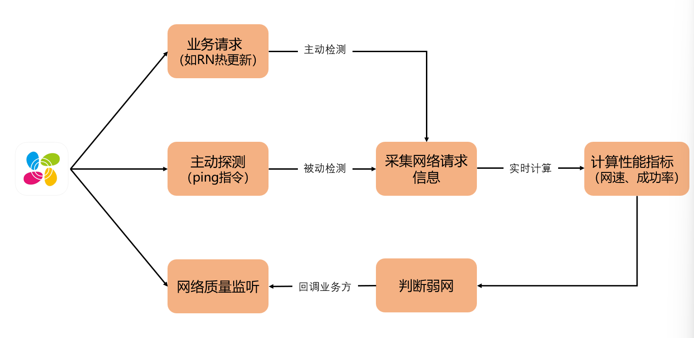

# 弱网定义  

## 网络性能指标：

**网速**：指传送数据的速率。速率是计算机网络中最重要的性能指标，单位是b/s(比特每秒，也写作bps ，即bit per second )

**请求成功率**：即一段时间内网络接口请求成功率

**带宽**：带宽用来表示网络的通信线路传送数据的能力，表示在单位时间内从网络中的某一点到另一点所能通过的“最高速率”。

**吞吐量（throughput）**：表示在单位时间内通过某网络的数据量。吞吐量常用于对网络的一种测量。吞吐量受网络带宽或者速率限制

**往返时间RTT（Round-Trip Time）**：表示从发送方发送数据开始，到发送方收到接收方的确认，总共经历的时间

**HttpRTT**：指从客户端请求的第一个字节开始发送到收到第一个数据包响应的时间差。这个时间包含3个部分，客户端发送数据到服务器耗时、服务器处理耗时、服务器响应数据到客户端耗时

## 弱网诊断观察的指标

弱网诊断根据HttpRTT和吞吐量来观察用户网络环境

HttpRTT：在不考虑服务器处理耗时的情况下，能够体现用户请求被处理的真实时延

吞吐量（throughput）：用户的额定速率能被系统提供的API获取到，然而其仅能表示设备能够提供的最大速率（一般很大），却不是真实速率，而测量真实的吞吐量更能体现出用户当前真实网络环境

# 现有方案

现有方案主要通过被动采集和主动探测两种方式来判断弱网，计算指标包含网速和成功率两个指标



现有方案的缺陷：

1. RTT受网络波动影响较大，单次检测不准确
2. 现有方案中，弱网的定义过于静态、单一，容易出现抖动

# 改进方案

改进方案可以结合携程和得物两个方案的总结，在主动探测和被动探测基础上，增加滑动窗口、EMA权重计算、防抖策略等方式，联合多指标计算，判断网络质量，使监测结果更加精准  

## 滑动窗口

保存最近T时间（如T=10s）内所有网络请求进行采样，计算性能指标（如HttpRTT和吞吐量），使时间窗口内采样值通过EMA加权运算，得到最终结果更加平滑

滑动窗口开启时机：第一个http请求时开启，10s为时间窗口，采样窗口内所有请求

滑动窗口关闭时机：10s内没有发生http请求，窗口空转，主动停止滑动窗口  

主动探测补偿：如果没有请求，主动探测三方url，采集请求过程数据

## 指数加权移动平均线 (EMA) 

滑动窗口内所有采样数据进行EMA加权计算，核心思路是距离当前时间越近的请求权重越高

**EMA公式：**

$$
EMA_{t} = (1-\alpha) \times EMA_{t-1} + \alpha \times X_{t}
$$

**其中：**

$$
\alpha = 1 - e^{-\Delta t / \tau}
$$

- $\Delta t$：当前样本与上次样本的时间间隔
- $\tau$：时间常数（决定记忆长度）
- $EMA_{t}$: 表示加权观测值
- $ X_{t}$: 表示当前观测值
- $\alpha$: 表示平滑因子，$\alpha$ 计算公式使时间越近的观测值权重越高

## 百分位统计（P90）  

在滑动窗口内，计算所有样本90分位数据，比计算平均值更能避免极端数据的干扰  

比如：一组数据包含10个样本，RTT时间分别是  

 `10ms,10ms,10ms,10ms,10ms,10ms,10ms,10ms,10ms,1000ms  `

p90 RTT是10ms，表示90%的请求≤10ms，比平均值109ms更有参考价值  

## 防抖策略  

连续N个窗口计算结果一致后，才认为状态发生了变化，不要单次窗口就翻转状态，防止网络波动导致频繁触发弱网上报  

比如：需要连续 3 个窗口判断为弱网才真正切换到弱网；恢复也需要连续 3 个窗口为好网才恢复  

例外情况：如果滑动窗口由主动探测触发，那么不执行防抖策略，过多的主动探测会消耗网络资源，影响业务

## 弱网阈值支持可配置  

弱网阈值支持远程配置，方便后续调整和优化

比如：RTT阈值、吞吐量阈值、滑动窗口大小、EMA平滑因子等关键参数  

可在 `NetworkQualityMonitor` 中调整以下参数：

```kotlin
companion object {
    private const val WINDOW_SIZE_MS = 10_000L        // 滑动窗口大小
    private const val WEAK_NETWORK_THRESHOLD_THROUGHPUT = 10.0  // 弱网吞吐量阈值
    private const val WEAK_NETWORK_THRESHOLD_RTT = 1000L        // 弱网RTT阈值
    private const val EMA_ALPHA = 0.3                 // EMA平滑因子
    private const val WEAK_NETWORK_COUNT_THRESHOLD = 3          // 防抖次数
    private const val PROBE_INTERVAL_MS = 5000L       // 主动探测间隔
}
```

## 多指标联合判断

综合考虑多个指标来判断网络质量，避免单一指标失效导致误判，在一次滑动窗口之内，计算所有样本RTT数据和吞吐量数据的EMA权值、百分位P90数据
```
isWeak = EMA(RTT) || EMA(throughput) || p90(RTT) || p90(throughput)
```

## 不同网络类型差异化监控  

不同网络类型下，用户的网络质量差异较大，弱网阈值也不相同，针对WiFi和蜂窝网络两种场景，设计不同的弱网阈值  

# Android端实现Demo

github代码仓地址 ：https://github.com/zzuljs/NetWorkQualityMonitor


# 参考文献

[1. 携程APP移动网络优化实践（弱网识别篇） ](https://cloud.tencent.com/developer/article/2465622)  
[2. 得物自研移动端弱网诊断工具的技术实践](https://tech.dewu.com/article?id=142)  
[3. 移动端弱网优化专题(一)：通俗易懂，理解移动网络的“弱”和“慢”](http://www.52im.net/thread-1587-1-1.html)   
[4. Google网络质量评估NQE核心实现代码](https://chromium.googlesource.com/chromium/src/+/HEAD/net/nqe/network_quality_estimator.cc)  